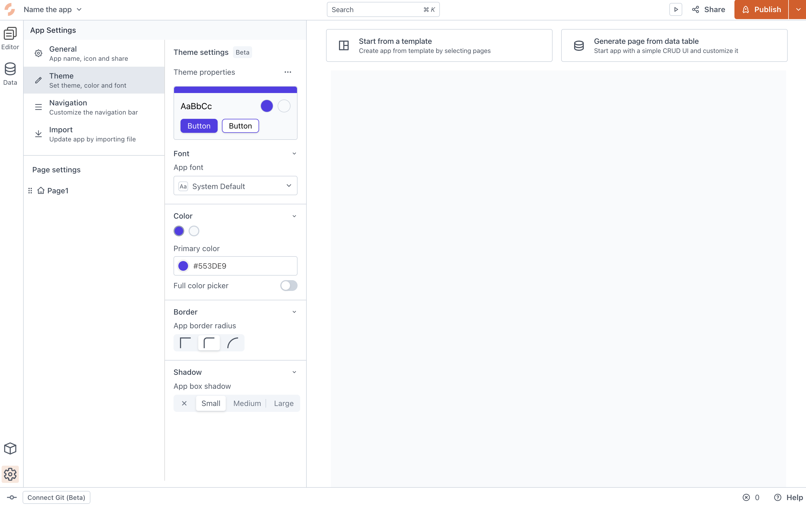
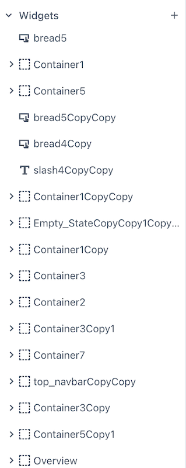

<!--
README

For guidance on how to write documenation, see https://dev.stage.spread.ai/docs/contributor/guide.html. Contact Documentation when this document is ready for review.
-->

These best practice guidelines and tips can help you create Studio apps that are easy to maintain and work with.

## Apply a user-centric design process

A user-centric design process starts with a focus on the user's needs:

* How will users use the app?
* What are users using the app for?
* Who are the users you are creating an app for?

Even if you are chiefly the technical developer of a Studio app it's important to keep the user in mind - including any developers that may maintain and build on the app in the future. For more on user-centered design, see [User-Centered Design: What It Is and How to Do It Right](https://blog.hubspot.com/website/user-centered-design).

## Use a code editor for queries and code

The code window in SPREAD Studio is not suitable for writing extensive code, as it is small and lacks many useful features that most code editors have. We recommend that you write your code and queries in your code editor and then copy it over to Studio.

## Wrap widget groups in containers

Use containers where you have widget groups that function together. This allows you to control properties, like visibility, at the container level and not in individual widgets. Much like <div\> container tags, these containers give you more broad controls and help sort a busy screens into logical segments.

For more on the Container widget settings, see the [Container](reference/widgets/container.md) reference page.

!!! info "Padding around containers"

	Be aware that containers have their own padding when designing the app layout. This means you may have widgets out of alignment from their expected positions if they were outside a Container. 

## Use multiple pages for complex apps

For complex Studio apps you may want to create a multi-page app. In this way you can keep your logic simple and keep your app maintainable. The more widgets and JavaScript objects and queries you have on a page, the more time it takes to maintain the page in the future. You may choose to create individual pages for each component or input screen to keep the complexity low.

---

{{ snippets.multipageApps }}

---

<figure markdown="span">
	
	<figcaption>Styling your Studio application</figcaption>
</figure>

## Use meaningful variable, component, widget, and query names

As your Studio app grows in complexity having an easy-to-understand naming convention will help keep it manageable. It's important to give widgets meaningful names and not use the default names, which tell you nothing about the widget's purpose and function.

<figure markdown="span">
	{height=300px}
	<figcaption>Examples of badly named widgets in Studio</figcaption>
</figure>

Likewise when naming queries, we recommend that you prefix the query with the action it applies - such as `Update_SystemObject`. Also descriptively name the query; especially in situations where the Studio app has multiple queries.
