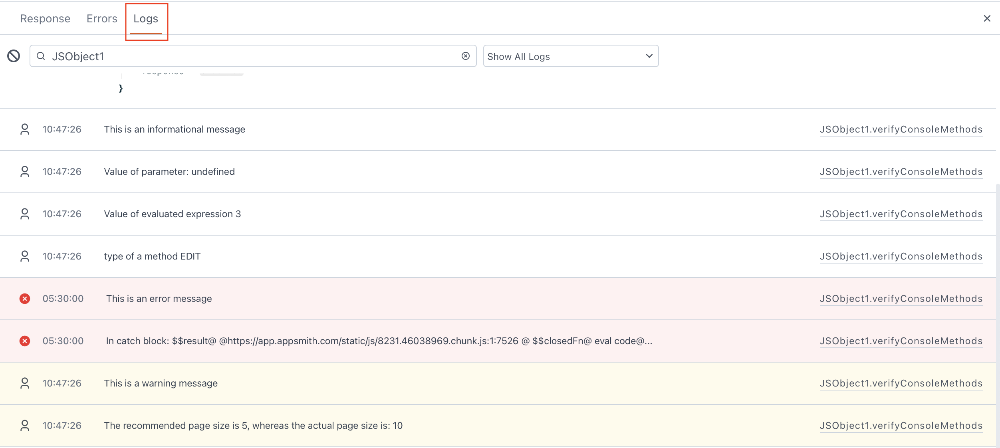

<!--
README

For guidance on how to write documenation, see https://dev.stage.spread.ai/docs/contributor/guide.html. Contact Documentation when this document is ready for review.
-->

The `console` object provides a way to output messages for code debugging. This page gives information about the `console` object and its methods.

<figure markdown="span">
  
  <figcaption>The Logs tab in SPREAD Studio</figcaption>
</figure>

## Methods

The methods log the messages in the **Logs** tab of the JavaScript, API, and query editors. The messages are not saved and are only available for the current session. The console methods do not support string substitutions.

### console.log()

The console.log() method is used for logging informational messages. It accepts one or more arguments, including strings, numbers, objects, or expressions. For example:

```javascript
console.log('This is an informational message'); // (1)!
console.log('Value of parameter:', param1); // (2)!
console.log('Value of evaluated expression', 1 + 2); // (3)!
console.log('Value of a property', appsmith.user.email); // (4)!
```

1. Logs the given string message.
2. Logs the value of `param1` after 'parameter:', with 'param1' being appended to the message.
3. Logs the value of an evaluated expression.
4. Logs the object property.

### console.error()

The `console.error()` method logs error messages and helps in reporting unexpected or critical issues in the code. It can take one or more arguments, such as strings, numbers, objects, or expressions. For example:

```javascript
console.error('This is an error message'); // (1)!

try { // (2)!
    // Some code that throws an error.
} catch (err) {
    console.error('In the catch block:', err); // (3)!
}
```

1. Logs the given error message.
2. Logs errors within a try-catch block.
3. Logs the error object.

### console.warn()

The `console.warn()` method logs warning messages, indicating potential issues or situations that might lead to errors. It can take one or more arguments, such as strings, numbers, objects, or expressions. For example:

```javascript
     console.warn('This is a warning message'); // (1)!
     console.warn('The recommended page size is 5, whereas the actual is: ', actual_page_size); // (2)!
```

1. Logs the given string message.
2. Logs the value of `actual_page_size` after 'is:'. The value of `actual_page_size` being appended to the message.
