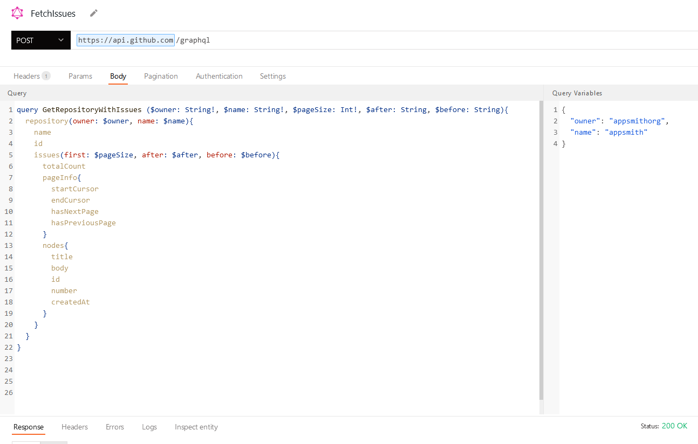
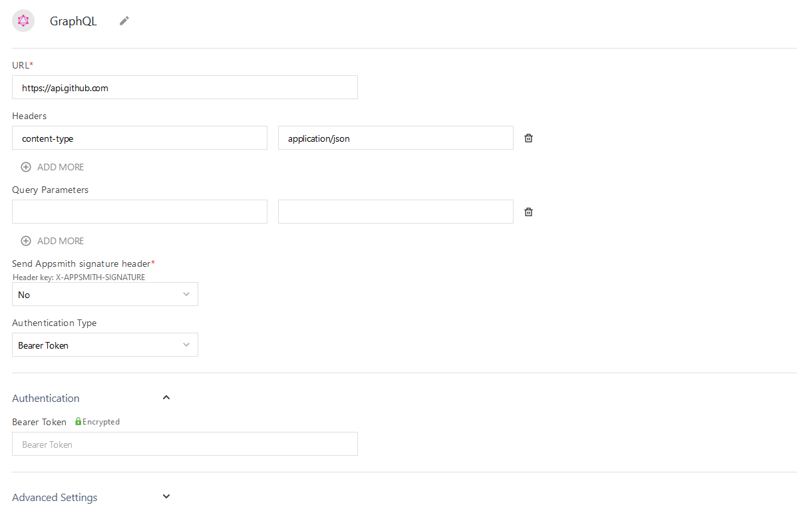
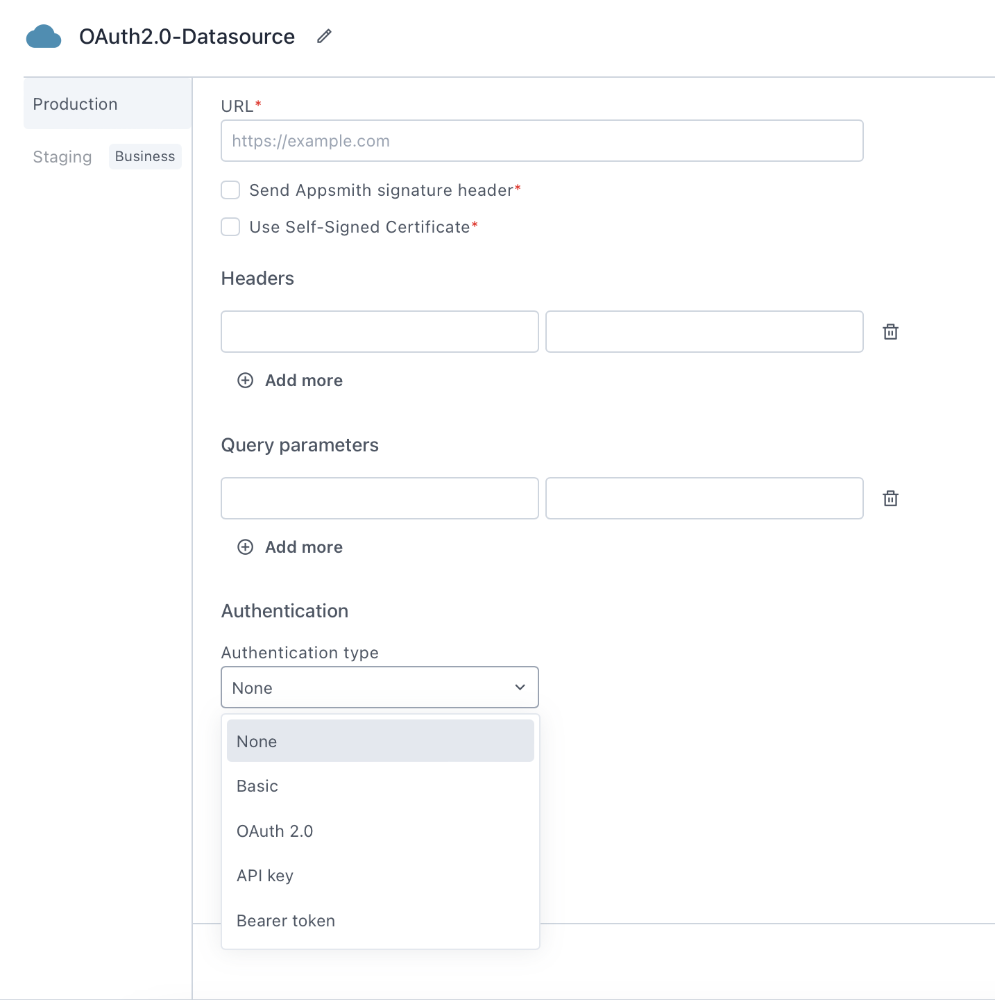

<!--
README

For guidance on how to write documenation, see https://dev.stage.spread.ai/docs/contributor/guide.html. Contact Documentation when this document is ready for review.
-->

This page provides information for connecting your application to a GraphQL API and for using queries to manage its content.

## Create queries

The following section is a reference guide that provides a complete description of all the read and write operation commands with their parameters to create GraphQL queries.

<figure markdown="span">
     
     <figcaption>Creating a GraphQL query</figcaption>
</figure>

GraphQL queries are written in the **Body** tab of the query screen. Use the **Query** window to construct your query or mutation, and the adjacent **Query Variables** window to add any variables to map into your query.

### Fetch records

Use a query like the one below to retrieve records from your datasource.

In the example below, `UsersTable` is the name of a Table widget used to search for a user by name and display the results. This query uses `limit` and `offset` to implement [**server-side pagination**](/build-apps/how-to-guides/Server-side-pagination-in-table).

In the **Query** window:

```javascript
query GetUserData ($name: String!, $limit: Int!, $offset: Int!) {
     user (name: $name, first: $first, offset: $offset) {
          id
          name
          email
          date_of_birth
     }
}
```

In the **Query variables** window:

```javascript
{
     "name": {{ '{{ UsersTable.searchText }}' }},
     "limit": {{ '{{ UsersTable.pageSize }}' }},
     "offset": {{ '{{ UsersTable.pageOffset }}' }}
}
```

### Insert a record

Use an insert mutation to add new records to your GraphQL datasource.

In the example below, `CreateUserForm` is the name of a [Form widget](widgets/form.md) used to collect input for the new record.

In the **Query** window:

```javascript
mutation CreateUser (name: String!, email: String!, date_of_birth: String!){
     createUser(name: $name, email: $email, date_of_birth: $date_of_birth) {
          id
          name
          email
          date_of_birth
     }
}
```

In the **Query variables** window:

```javascript
{
     "name": {{ '{{ CreateUserForm.data.name }}' }},
     "email": {{ '{{ CreateUserForm.data.email }}' }},
     "date_of_birth": {{ '{{ CreateUserForm.data.date_of_birth }}' }}
}
```

### Update a record

Use an update mutation to modify an existing record in your dataset.

In the example below, `UpdateUserForm` is the name of a [Form widget](widgets/form.md) used to collect input for the new record.

In the **Query** window:

```javascript
mutation UpdateUser (id: Int!, name: String, email: String, date_of_birth: String){
     updateUser(id: $id, name: $name, email: $email, date_of_birth: $date_of_birth) {
          id
          name
          email
          date_of_birth
     }
}
```

In the **Query variables** window:

```javascript
{
     "id": {{ '{{ UpdateUserForm.data.id }}' }}
     "name": {{ '{{ UpdateUserForm.data.name }}' }},
     "email": {{ '{{ UpdateUserForm.data.email }}' }},
     "date_of_birth": {{ '{{ UpdateUserForm.data.date_of_birth }}' }}
}
```

### ​Delete a record​

Use a delete mutation to delete an existing record from your dataset.

In the example below, `UsersTable` is the name of a Table widget used to display the results from a previous query.

In the **Query** window:

```javascript
mutation DeleteUser (id: Int!){
     deleteUser(id: $id) {
          id
          name
          email
          date_of_birth
     }
}
```

In the **Query variables** window:

```javascript
{ "id": {{ '{{ UpdateUserForm.data.id }}' }} }
```

## Connection parameters

Authenticated GraphQL API datasources share configuration fields with the Authenticated API datasource.

<figure markdown="span">
     
     <figcaption>Configure a GraphQL datasource</figcaption>
</figure>

## Connection parameters

The following section provides a detailed view of essential as well as optional parameters to establish a connection with an API datasource.

<figure markdown="span">
     
     <figcaption>Configuring an Authenticated API datasource</figcaption>
</figure>

!!! warning

     The datasource configuration fields do not accept JavaScript code or bindings using mustache `{{ '{{}}' }}` syntax.

### URL

The uniform resource locator (URL) specifies the address of the service or endpoint to which the requests will be made. This is typically the base URL of the REST API you are connecting to.

### Send Studio signature header

When enabled, Studio adds an extra header, `X-AppSmith-Signature`, to your requests. This header contains a JSON Web Token (JWT) signed with a secret string. You can use this header to verify that the incoming requests are originating from Studio. This mechanism ensures the integrity and authenticity of requests originating from Studio.

### Use self-signed certificate

When enabled, this option allows you to upload a self-signed certificate in the .PEM (Privacy Enhanced Mail) format, which is securely stored in an encrypted format. This certificate is then included in the request made by Studio to the endpoint.

### Headers

Headers contain key-value pairs that you include in the header section of your HTTP requests. You use headers to provide information to the server, such as authentication tokens, content types, or custom headers required by the API you are connecting to.

### Query parameters

Query parameters consist of key-value pairs passed as parameters in the URL of your HTTP requests. You use query parameters to provide specific information to the server, such as filtering criteria, sorting options, or specific data needed for the request.

### Authentication type

The authentication type setting determines the method used to authenticate requests. You can configure the details under the Authentication dropdown menu. The available options are:

- **None**- When selected, Studio doesn't send authentication information with the request. Use this option if your API doesn't require authentication details in the request.  
- **Basic**- When selected, Studio sends the Username and Password in the Authorization header of each request as a base64-encoded string. Use this option if your API requires username and password details in the request.
- **OAuth 2.0**- When selected, Studio enables integration with APIs that require OAuth 2.0 authentication. With OAuth 2.0 you can configure secure authorization flows, allowing you to grant limited access to resources.
- **API Key**- When selected, Studio sends a key-value pair in the Authorization header of each request. This method is commonly used for API authentication, where the API hosting provider supplies a unique API key to the client for securely accessing the APIs.
- **Bearer Token**- When selected, Studio sends a bearer token value in the Authorization header of each request. This method is commonly used for token-based authentication, where the API hosting provider supplies a token to the client for securely accessing the APIs.
