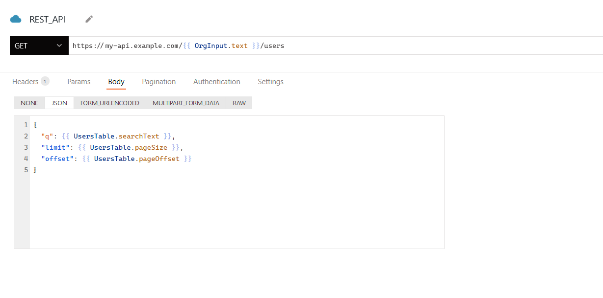

<!--
README

For guidance on how to write documenation, see https://dev.stage.spread.ai/docs/contributor/guide.html. Contact Documentation when this document is ready for review.
-->

This page describes how to connect your application to a REST API and use queries to read and write data in your applications.

Use this datasource to create a single query for an API that doesn't need complex authentication settings. If you plan to create multiple queries for the same API, you may want to use an Authenticated API datasource. Every query created from an Authenticated API datasource shares configuration - root URL, authentication, headers, and so on - to avoid re-entering details.

## Query REST API

The following section is a reference guide that provides a description of the parameters to create REST API queries.

<figure markdown="span">
     
     <figcaption>Configuring a REST API query</figcaption>
</figure>

#### Method

 Sets the REST method (`GET`, `POST`, and so on) to use for the request.

#### URL

 Sets the endpoint to query.

#### Headers

Sets key/value pairs to send in the request header.

#### Params

 Sets key/value pairs to send as query parameters in the request.

#### Body

Studio supports a variety of encoding types for sending data in API queries. The encoding type can be selected via the **Body** dropdown on the API editor.

##### Values from a Table widget
In the example, values are collected from a Table widget and passed into a JSON object.
Options:

* **None:** Omits a body from the request.
* ***JSON:** Expects a JSON object to send as the body.

```js
{
     {
        "query": {{ '{{ UsersTable.searchText }}' }},
        "limit": {{ '{{ UsersTable.pageSize }}' }},
        "offset": {{ '{{ UsersTable.pageOffset }}' }}
     }
}
```

##### Values from form data

This option expects key/value pairs to be encoded into **FORM_URLENCODED** format as the body.

| Key | Value |
| --- | ---- |
| query  | `{{ '{{ UsersTable.searchText }}' }}` |
| limit  | `{{ '{{ UsersTable.pageSize }}' }}`   |
| offset | `{{ '{{ UsersTable.pageOffset }}' }}` |

`{// result "query=arjun&limit=10&offset=20" }`

Selecting **FORM_URLENCODED**, for `application/x-www-form-urlencoded`, automatically encodes your key/value pairs for sending in the request body.

##### Values from multipart form data

This option expects key/value pairs with a data type to be encoded into the `MULTIPART_FORM_DATA` format as the body. Multipart requests can include several different types of data within them, such as a file along with some other related metadata. Values of multiple types are pulled from widgets and added to the query, including file data from the [Filepicker](widgets/filepicker.md) widget

| Key | Type | Value |
| --- | --- | --- |
| user | Text | `{{ '{{ appsmith.user.email }}' }}` |
| filename | Text | `{{ '{{ FileNameInput.text }}' }}` |
| file | File | `{{ '{{ Filepicker.files[0] }}' }}` |

`{// result "query=arjun&limit=10&offset=20" }`

##### Values from file data

When uploading file data, check that your Filepicker widget's **Data Format** property is set correctly. When uploading as multipart/form-data, this should usually be set to `Binary`.

For any Base64 upload, including text files, images, videos, and more, ensure that you include the file data in the body. If you're using Binary to upload files, remember to set the [Data Format](widgets/filepicker.md#data-format-string) property of the Filepicker widget to `Base64`. This ensures that the file data is encoded correctly before transmission. Moreover, if the API you are connecting with expects additional key/value pairs, you can include them along with file data in the body.

`{{ '{{ imgFilepicker.files[0].data }}' }}`

In the above example, if the API expects to supply only the image data, use the `data` property of the Filepicker widget to send the data of the selected image file.

For any raw upload, the process expects raw binary file data to be sent as the body
`{{ '{{ Filepicker1.files[0]?.data }}' }}`. The `data` property of the file is passed to the query instead of the file object itself because the endpoint expects only raw binary data.

Use **RAW** if your endpoint can't accept multipart-encoded data and requires raw body binary instead. Above, </p>

!!! warning
     Turn off **JSON Smart Substitution** for this query in the query settings. This option usually helps cast data into correct JSON, but is problematic when used with RAW binary.

#### Pagination

Options:

* **None:** Doesn't use any pagination.
* ***Paginate with Table Page No:** Use when your API expects an offset or increment value to determine which set of records to return. Follow the instructions that appear on the platform.
* **Paginate with Response URL:** Use when your API returns cursor values to page through data. The **Previous URL** and **Next URL** fields expect the cursor values from the query response.


#### Authentication

Click the button in the **Authentication** tab to turn this query into a new Authenticated API datasource where you can configure Authentication for your requests.


## Fetch API

The Fetch API provides an interface for executing network calls programmatically. You can use `fetch()` to programmatically configure and execute a REST API.  

### GET request

Fetches data from the specified URL using a GET request and parses the JSON response.

```javascript
const questions = await fetch("https://opentdb.com/api.php?amount=10")
return questions.json()
```

### POST request

Sends a POST request to create a new resource with the provided data and logs the success or error.

```javascript
fetch("https://63772c9a5c477765121615ba.mockapi.io/users", {
     method: "POST",
     headers: {
     "Content-Type": "application/json",
     },
     body: JSON.stringify({
     name: "Alex",
     email: "alex@docs.spread.ai",
     }),
}).then((response) => {
     console.log("Success:", response.json());
}).catch((error) => {
     console.error("Error:", error);
});
```

### PUT request

The PUT method in the Fetch API is used to update a resource on the server. It is typically used when you want to update the entire resource or create it if it doesn't exist. Here's an example of how you can use the PUT method with the Fetch API:

```js
fetch("https://63772c9a5c477765121615ba.mockapi.io/users/1", {
     method: "PUT",
     headers: {
          "Content-Type": "application/json",
     },
     body: JSON.stringify({
          name: "UpdatedName",
          email: "updated_email@example.com",
     }),
     })
     .then((response) => {
          if (!response.ok) {
               throw new Error(`HTTP error! Status: ${response.status}`);
          }
          return response.json();
     })
     .then((data) => {
          console.log("Success:", data);
     })
     .catch((error) => {
          console.error("Error:", error);
});
```

### File upload

Uploads a file using a [POST request](#post-request) with a FormData object and logs the response.

```javascript
const formData = new FormData();
formData.append("file", FilePicker1.files[0]);
		
let response = await fetch('https://httpbin.org/post', {
	method: 'POST',
	body: formData
});
```
