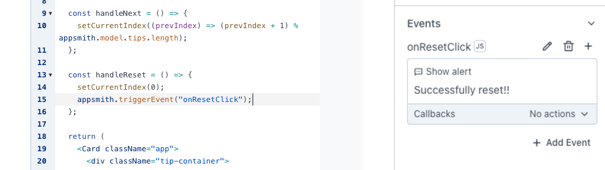
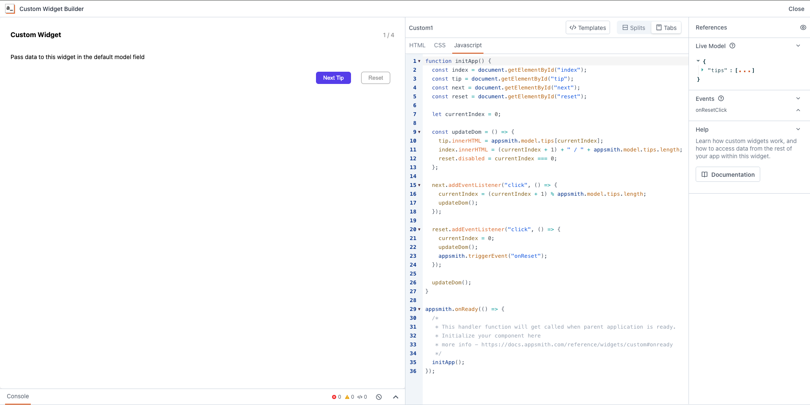
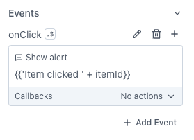

<!--
README

For guidance on how to write documenation, see https://dev.stage.spread.ai/docs/contributor/guide.html. Contact Documentation when this document is ready for review.
-->

While Studio provides an extensive array of built-in widgets for application development, there are instances where your project demands a widget tailored to specific requirements. Studio's Custom widget allows you to integrate unique functionalities with your HTML, CSS, and JavaScript code for additional functionality.

For more information, see [How to create Custom widgets](/tutorials/create-custom-widgets.md).

!!! info "src URLs"
     
     While Custom widgets support integrating HTML or React components, iframes with `src` URLs will not be loaded within Custom widgets. To use iFrames, consider using the [iFrame widget](iframe.md).


## Content properties

These properties are customizable options present in the property pane of the widget, allowing users to modify the widget according to their preferences.

### Widget

#### Edit Source

 

Allows you to customize the code for the custom widget. When clicked, it opens a dedicated page where you can conveniently modify and update the widget's code to suit your requirements.

For more information, see [Custom Widget Builder](#custom-widget-builder).


#### Default Model

 

This property allows you to pass object data to the custom widget's code editor. You can use mustache binding `{{ '{{}}' }}` to pass data from queries or other widgets.

 If you want to pass the name from a Table widget to the custom widget, use the following code:

```js
{ "name": "{{ '{{Table1.selectedRow.name}}' }}" }
```

To access the data in the JavaScript editor in Custom widget builder page, use `appsmith.model.{property-name}`. To access data in CSS Editor in Custom widget builder page, use `var(--appsmith-model-{property-name}`


### General

#### Visible `boolean`

 

Controls the visibility of the widget. If you turn off this property, the widget would not be visible in View Mode. Additionally, you can use JavaScript by clicking on **JS** next to the **Visible** property to conditionally control the widget's visibility. The default value for the property is `true`.

For example, if you want to make the widget visible only when the user selects "Yes" from a Select widget, you can use the following JavaScript expression:

```js
{
     {
          Select1.selectedOptionValue === "Yes";
     }
}
```


#### Height `string`

 

This property determines how the widget's height adjusts to changes in its content. There are three available options:

- **Fixed**: The widget's height remains as set using drag and resize.
- **Auto Height**: The widget's height adjusts dynamically in response to changes in its content.
- **Auto Height with limits**: Same as **Auto height**, with a configurable option to set the minimum and maximum number of rows the widget can occupy.


!!! warning "Auto height features"

     For the auto height feature to work properly, you should not set height of the container of the custom widget in the source editor. Setting a height will restrict the container from growing as a result the auto height feature will not kick in.


### Events

 

Allows you to create multiple events, providing the flexibility to configure various actions tailored to your specific requirements, such as Framework functions, queries, or JavaScript functions.

These events can be triggered in the JavaScript code editor of the Custom widget using the `appsmith.triggerEvent("eventName")`.

To trigger an event from the custom widget upon a button click, create a new event named **onResetClick** and add the following in the JavaScript code:

```js
const handleReset = () => {
     setCurrentIndex(0);
     appsmith.triggerEvent("onResetClick");
};
```


<figure markdown="span">
     
     <figcaption>Left: Custom Widget Builder | Right: Widget Events</figcaption>
</figure>


## Reference properties

Reference properties are properties that are not available in the property pane but can be accessed using the dot operator in other widgets or JavaScript functions. They provide additional information or allow interaction with the widget programmatically. For instance, to get the visibility status, you can use `Custom1.isVisible`.

#### model `string`

 

The `model` property retrieves the value from the Custom widget and **Default Model** property.


```js
{{ '{{Custom1.model}}' }}
{{ '{{Custom1.model.signatureImage}}' }} // (1)!
```

1. Accessing a specific property


#### isVisible `boolean`

 

The `isVisible` property indicates the visibility state of a widget, with true indicating it is visible and false indicating it is hidden.


```js
{{ '{{ Custom1.isVisible }}' }}
```


## Custom Widget Builder

This section, which you can open by clicking on the edit source button on property pane of the custom widget, provides the Custom Widget Code Editor, which allows you to edit HTML, JS, and CSS code for your custom widgets.


<figure markdown="span">
     
     <figcaption>The Custom Widget Builder</figcaption>
</figure>

When creating your custom component, skip `<html>` and `<body>` tags. Instead, add only essential tags directly in your HTML code. When importing libraries, opt for ESM (ECMAScript Module) or UMD (Universal Module Definition) method. Use trusted CDN providers like [jsDelivr](https://www.jsdelivr.com/) or [UNPKG](https://unpkg.com/) for library imports.


### Javascript API

These properties are accessible within the JavaScript editor, providing specific functionalities and customization options.

#### model `object`

 

The `model` property retrieves the value passed in the **Default Model** property of the Custom widget.

```js
appsmith.model; // (1)!
appsmith.model.propertyname; // (2)!
```

1. Access the entire model.
2. Access a specific property in the model


#### mode `string`

 

The `mode` property represents the current render context of the Custom widget.

```js
appsmith.mode; // (1)!
```

1. Value can `EDITOR`, `BUILDER`, or `DEPLOYED`.


#### theme `object`

 

The `theme` object reflects the current theme of the Studio application.

- `primaryColor` (`string`): Represents the primary color of the application theme.
- `backgroundColor` (`string`): Represents the background color of the application theme.
- `borderRadius` (`string`): Specifies the border radius used in the application theme.
- `boxShadow` (`string`): Represents the box shadow applied in the application theme.

```js
appsmith.theme;
```


#### ui `object`

 

Provides access to the UI elements of the widget, such as width and height, in pixels.

```js
appsmith.ui;
```


### Methods

#### updateModel

 

The `updateModel` property allows you to dynamically update the model properties. This enables real-time synchronization between the Custom widget and the parent application.

 If you want to save a signature from a Signature pad custom widget, upon button click, use the following code:

```js
document.getElementById("saveBtn").addEventListener("click", function () {
  var dataURL = signaturePad.toDataURL();
  // Implement logic to save the signature data (e.g., send to server)
  appsmith.updateModel({ signatureImage: dataURL });
});
```

Once button is clicked, the signature pad data will be available on the custom widget model property. you can use this data in another widget using the `{{ '{{}}' }}` binding.

 You can bind signature pad data to an image widget by pasting following code on Image widget's `image` property on the property pane.

```js
{{ '{{ Custom1.model.signatureImage }}' }}
```


#### triggerEvent

 

You can execute custom events that you created in the property pane of the custom widget by calling this function with the name of the event. You can also pass some optional data by including a second argument.


 Let's say you have buttons in your custom component, upon clicked, you want to trigger `onClick` event along the itemId

```js
function onClick() {
  appsmith.triggerEvent("onClick", { itemId: 1 });
}
```


<figure markdown="span">
     
     <figcaption>Custom Widget custom event: onClick</figcaption>
</figure>


#### onModelChange

 

The `onModelChange` function allows you to register a handler function, which will be called whenever there is a change in the model, either from the platform or from within the custom widget (for example, via the `updateModel` function). This is useful for responding to changes in the widget's state.

However, it's important to ensure that changes triggered by your widget's own updates don't lead to infinite loops. You can handle this by adding a condition to check if the relevant part of the model has actually changed before performing any updates.


```js
const unlisten = appsmith.onModelChange((newModel) => { // (1)!
     if (newModel.selectedItem !== appsmith.model.selectedItem) { // (2)!
          setSelectedItem(newModel.selectedItem); // (3)!
     }
});

document.getElementById("itemSelect").addEventListener("change", function(event) { // (4)!
     appsmith.model.selectedItem = event.target.value;
     setSelectedItem(event.target.value); // (5)!
});

unlisten(); // (6)!
```

1. Monitor changes in the model (for example, a dropdown selection).
2. Compare the selected item and update if there's a change.
3. Update the display only if the selected item has changed.
4. Event listener to update the model when the dropdown value changes.
5. Ensure immediate update on change.
6. Unsubscribe when no longer interested in updates.

When the condition is applied, updates occur only when the selected item changes, preventing unnecessary updates and avoiding infinite loops. When you're no longer interested in listening to the model change , call the return value of the `appsmith.onModelChange` function.


#### onUiChange

 

Allows a handler function to be called whenever the UI changes i.e width, height, providing a useful mechanism for updating components affected by UI changes from the platform.

```js
const unlisten = appsmith.onUiChange((ui) => {
     setComponentWidth(ui.width);
});

unlisten();
```


#### onReady

 

The **onReady** event in Studio is a mechanism to wait for the parent application to complete its initialization before executing custom widget logic. Use `appsmith.onReady` to pass a handler function. This handler gets called when the parent application is ready, and you should begin rendering your component from this handler.

```js
appsmith.onReady(() => {
  /* You need to initiate the component here. For example,
   * if you have a react component - call reactDom.render here and
   * if you have vanila JS component - call the contructor or initiate here.
   */
});
```

!!! warning 

     Initializing your component inside the `onReady` handler function is important as it ensures that the parent application is ready to communicate with your custom component before initialization.


#### onThemeChange

 

Subscribe to theme changes and execute a callback function.

```js
const unlisten = appsmith.onThemeChange((theme, oldTheme) => { // (1)!
     setPrimaryColor(theme.primaryColor);
});

unlisten(); // (2)!
```

1. Set the primaryColor of your component using a function.
2. Unsubscribe when no longer interested in updates.


### CSS API

These CSS variables are accessible within the CSS editor, offer specific functionalities and customization options. The variables fall into three groups: model variables, UI variables, and theme variables. Studio updates the values of these properties when the corresponding source changes.

#### model

 

The `model` property retrieves the value passed in the **Default Model** property of the Custom widget. Studio automatically generates corresponding CSS variables for each string and number property within your model. This feature is beneficial for transmitting CSS configurations, such as width or color, through your model.

```js
/* CSS Variable Naming Convention: --appsmith-model-<property-name> */

// For instance, with the following Default Model:
{
	"mainColor": "#000",
	"borderWidth": "1px"
}

// Studio automatically creates the corresponding variables:
--appsmith-model-mainColor
--appsmith-model-borderWidth

// Utilize them as follows:
button {
	background-color: var(--appsmith-model-mainColor);
	border: var(--appsmith-model-borderWidth) solid var(--appsmith-model-mainColor);
}
```


#### UI and theme

 

These CSS variables, available to control widget size and define the theme:

- `ui`: representing the height and width of the widget in pixels.
- `theme`: representing the selected theme of your application.

```js
//Widget size
--appsmith-ui-width;
--appsmith-ui-height;

//Application theme
--appsmith-theme-primaryColor;
--appsmith-theme-backgroundColor;
--appsmith-theme-borderRadius;
--appsmith-theme-boxShadow;
```

:::info
`--appsmith-ui-width` and `--appsmith-ui-height` are number types, to convert them to px, you can use

`calc(var(--appsmith-ui-width) * 1px)`
:::


