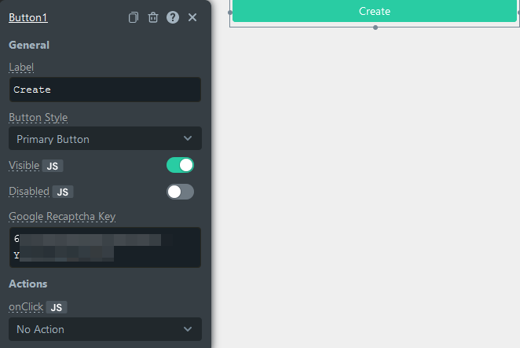

<!--
README

For guidance on how to write documenation, see https://dev.stage.spread.ai/docs/contributor/guide.html. Contact Documentation when this document is ready for review.
-->

[Google reCAPTCHA](https://www.google.com/recaptcha) is a service provided by Google that returns a user score without any interaction from the user. This can be integrated with [buttons](buttons.md) to prevent bots from clicking the button on your website without a human present.

## Setting up Recaptcha

1. Go to the reCAPTCHA [add site page](https://www.google.com/recaptcha/admin/create).
2. Create a new site with version reCAPTCHA v3 and the domain `app.studio.com`,
3. Copy the site and secret key.
4. Paste the site key into the [button](button.md) reCAPTCHA field

<figure markdown="span">
     
     <figcaption>The recaptcha field in Button config</figcaption>
</figure>

5. Configure the server-side integration on your back-end.

The exact steps depend on your back-end, see [Google's reference](https://developers.google.com/recaptcha/docs/verify) for detailed instructions.

## Validating recaptcha

The user's reCAPTCHA response can be obtained in the **API** Pane with the `recaptchaToken` key.

Make a `POST` request to [Google Site Verify](`https://www.google.com/recaptcha/api/siteverify) with the secret key and response parameters to retrieve the score in a JSON format:

```javascript
{
     "success": true|false, // (1)!
     "score": number, // (2)!
     "action": string, // (3)!
     "challenge_ts": timestamp, // (4)! 
     "hostname": string, // (5)!
     "error-codes": [...]
}
```

1. Signals if the request was a valid reCAPTCHA token for your site.
2. The score for this reques, from 0.0 to 1.0.
3. The action name for this request, which is important to verify.
4. tThe timestamp of the challenge load in ISO format `yyyy-MM-dd'T'HH:mm:ssZZ`.
5. The hostname of the site where the reCAPTCHA was solved.

### Validation example

Now that you have registered the site with [Google Recaptcha](https://www.google.com/recaptcha/about/), you can validate if it is working by using a [button widget](/button.md) and adding an API. Follow these steps to validate the reCAPTCHA:

1. Drag and drop a [button widget](button.md) onto the canvas.
2. Add the **site key** to the [button's `Google reCAPTCHA Key`](button.md#validation)property. To get the key, navigate to [Google reCAPTCHA v3 Admin Console](https://www.google.com/recaptcha/admin), select **Settings** for your site, expand **reCAPTCH Keys** section, and select **Copy Site Key**.
3. Navigate to **Explorer**, add **New Blank API**, and then add details as below:
     * Add **Header** `content-type` as `multipart/form-data`.
     * Select the HTTP Method as `POST`.
     * Add URL `https://www.google.com/recaptcha/api/siteverify`.

4. Select **Body** tab and add details as below:
     * Select `MULTIPART_FORM`_`_`_`DATA`.
     * Add key as **response** and bind the button's recaptchaToken property by using `{{ '' }}`.
     * Add key as **secret** and add your site's **Recaptcha secret key**.

To get secret keys, navigate to  [Google reCAPTCHA v3 Admin Console](https://www.google.com/recaptcha/admin), select **Settings** for your site, expand the **reCAPTCH Keys** section, and select **Copy Secret Key**.

Once the API is set up, click the **button** to trigger the validation. On successful validation, you'll see the response generated as below in the API response tab:

```js
{
     "success": true,
     "challenge_ts": "2022-08-09T12:55:40Z",
     "hostname": "app.appsmith.com",
     "score": 0.9,
     "action": "submit"
}
```
