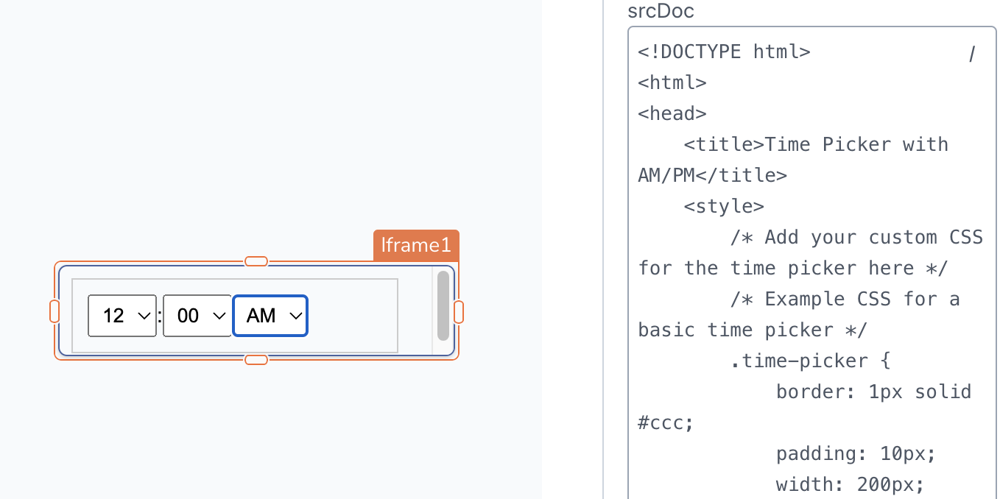

<!--
README

For guidance on how to write documenation, see https://dev.stage.spread.ai/docs/contributor/guide.html. Contact Documentation when this document is ready for review.
-->

This page provides information on using the iFrame widget to embed third-party applications and websites into your Studio application.

## Content properties

These properties are customizable options present in the property pane of the widget, allowing users to modify the widget according to their preferences.

### Data

#### URL `string`

Allows you to specify the URL of the page or application you want to display within the iFrame. For instance, by adding `https://docs.appsmith.com/` to the **URL** property, you can display the Studio docs in your Studio application.

<ZoomImage src="/img/iframe-website.png" alt="Display external website" caption="Display external website" />

#### srcDoc `string`

Allows you to embed HTML and CSS within `<style>` tags to render in the iFrame. When this property has a value, it overrides the URL property.

In addition to static HTML, you can display data generated dynamically from queries or JavaScript functions in the **srcDoc** property using the mustache syntax `{{ '{{ }}' }}`.

For example, suppose you want to create a simple time-picker:

??? abstract "Demo HTML file"

     ```html
     <!DOCTYPE html>
     <html>
     <head>
     <title>Time Picker with AM/PM</title>
     <style>
          /* Add your custom CSS for the time picker here */
          /* Example CSS for a basic time picker */
          .time-picker {
               border: 1px solid #ccc;
               padding: 10px;
               width: 200px;
               font-family: Arial, sans-serif;
               font-size: 14px;
               display: flex;
               align-items: center;
          }
          select {
               padding: 5px;
          }
     </style>
     </head>
     <body>
     <div className="time-picker">
          <select id="hour">
               <!-- Add options for hours in 12-hour format with AM/PM -->
               <option value="12">12</option>
               <option value="01">01</option>
               <!-- ... Continue with options for 02 to 11 ... -->
               <option value="11">11</option>
          </select>
          <span>:</span>
          <select id="minute">
               <!-- Add options for minutes -->
               <option value="00">00</option>
               <option value="15">15</option>
               <!-- ... Continue with options for 30 and 45 ... -->
               <option value="45">45</option>
          </select>
          <select id="amPm">
               <option value="AM">AM</option>
               <option value="PM">PM</option>
          </select>
     </div>
     </body>
     </html>
     ```

<figure markdown="span">
     
     <figcaption>Creating a custom time picker using iFrames</figcaption>
</figure>

Additional information:

* If the iFrame widget has a value in the **srcDoc** property, it overrides the **URL** property.
* If [X-Frame-Options](https://developer.mozilla.org/en-US/docs/Web/HTTP/Headers/X-Frame-Options) is set to DENY on the external page or website, the iFrame widget fails to load.

Fore more information, see [How to create custom widgets](/tutorials/create-custom-widgets.md).

### General

#### Title `string`

Set a title for the content displayed within the iFrame.

#### Animate Loading `boolean`

This property controls whether the widget is displayed with a loading animation. When enabled, the widget shows a skeletal animation during the loading process. Additionally, you can control it through JavaScript by clicking on the **JS** next to the property. The default value for the property is `true`.

### Events

When the event is triggered, these event handlers can execute queries, JS functions, or other [supported actions](/reference/framework/global-functions.md).

#### onURLChanged

Specifies the action to be performed when the widget's **URL** property is changed.

#### onSrcDocChanged

Specifies the action to be performed when the **srcDoc** property of the widget is changed.

#### onMessageReceived

Specifies the action to be performed when a `postMessage` event is received from the embedded page.

## Style properties

Style properties allow you to change the look and feel of the widget.

### Color

#### Background Color `string`

Sets a color for the iFrame's border, specified as a [CSS color value](https://developer.mozilla.org/en-US/docs/Web/CSS/color). It can also be manipulated programmatically using the JavaScript functions.

### Border and shadow

#### Border Width `number`

Specifies the width of the widget's border, accepting only numerical values in pixels (px). The default value is `1`.

#### Border Opacity	`number`

This property controls the opacity level of the widget's border. The maximum value is 100, which represents full opacity. Default value is `100`.

#### Border radius `string`

Applies rounded corners to the outer edge of the widget. If JavaScript is enabled, you can specify valid [CSS border-radius](https://developer.mozilla.org/en-US/docs/Web/CSS/border-radius) to adjust the radius of the corners.

#### Box Shadow `string`

This property adds a drop shadow effect to the frame of the widget. If JavaScript is enabled, you can specify valid [CSS box-shadow](https://developer.mozilla.org/en-US/docs/Web/CSS/box-shadow) values to customize the appearance of the shadow.

## Reference properties

Reference properties are properties that are not available in the property pane but can be accessed using the dot operator in other widgets or JavaScript functions. They provide additional information or allow interaction with the widget programmatically. For instance, to get the visibility status, you can use `iFrame1.isVisible`.

#### isVisible `boolean`

Indicates the visibility state of a widget, with `true` indicating it is visible and `false` indicating it is hidden.

```js
{{ '{{iFrame1.isVisible}}' }}
```

#### source `string`

Contains the URL of the embedded page. Doesn't reflect the content set in the **srcDoc** property.

```js
{{ '{{iFrame1.source}}' }}
```

#### title `string`

Contains the title of the iFrame as set in the widget's **Title** property.

```js
{{ '{{iFrame1.title}}' }}
```

#### message `string`

The `message` property contains a message received from the embedded page via the JavaScript `postMessage()` method. This message can be of any type and is `undefined` before a message is received. Learn more about [postMessage().](https://developer.mozilla.org/en-US/docs/Web/API/Window/postMessage)

```js
{{ '{{iFrame1.message}}' }}
```

#### messageMetadata `string`

The `messageMetadata` property contains metadata related to the message received from the embedded page through the JavaScript `postMessage()` method.

```js
{{ '{{iFrame1.messageMetadata}}' }}
```

## Methods

Widget property setters enable you to modify the values of widget properties at runtime, eliminating the need to manually update properties in the editor.

These methods are asynchronous and return a [Promise](/writing-code-in-studio/using-js-promises.md). You can use the .then() block to ensure execution and sequencing of subsequent lines of code in Studio.

#### setVisibility (param: boolean): Promise

Sets the visibility of the widget.

```js
iFrame1.setVisibility(true)
```

#### setURL (param: string): Promise

Allows you to dynamically change the content of the iFrame by providing a new URL.

```js
iFrame1.setURL('<https://example.com>')
```

### Limitations

You cannot create custom widgets using iFrame that rely on underlying platform capabilities, such as:

* Widgets that act as a canvas or parent for other widgets. Eg: _Container_.
* Widgets that act as a modal or drawer on top of the existing canvas.
* Cannot use auto height or responsiveness features for widgets within the iFrame.

Studio currently does not support HTML formatting and error parsing. As a result, Studio cannot identify any HTML or CSS errors in the **srcDoc** property.

For complex widgets with frequent updates, it is advisable to use an external service like [CodeSandbox](https://codesandbox.io/) or host your own code to maintain your solution more efficiently.
