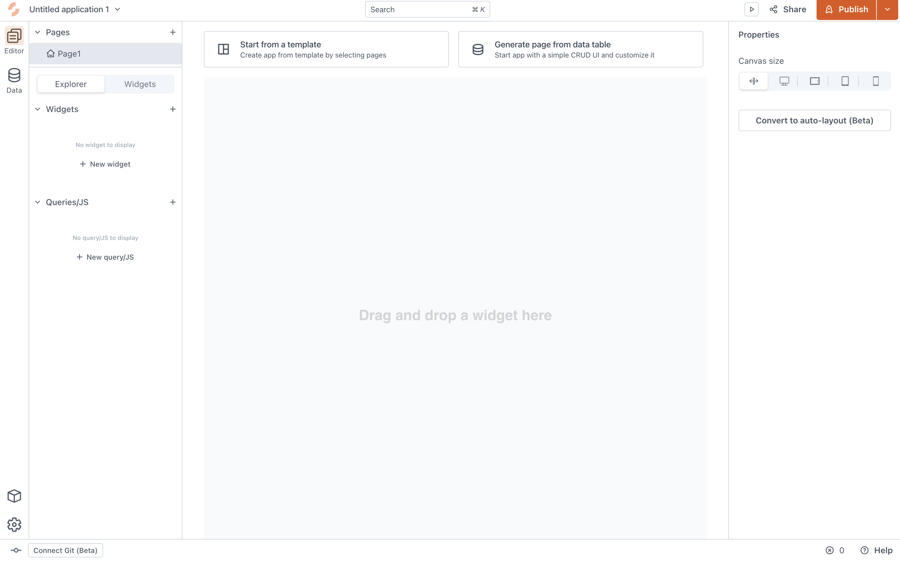

<!--
README

For guidance on how to write documenation, see https://dev.stage.spread.ai/docs/contributor/guide.html. Contact Documentation when this document is ready for review.
-->

SPREAD Studio is a tool to create applications that build on your product knowledge. Studio allows you to visualize, manage, and interact with the product knowledge and create applications for your unique needs.

<figure markdown="span">
  
  <figcaption>The canvas of SPREAD Studio</figcaption>
</figure>

With Studio you can create applications that:

- Display dashboards that use your product data.
- Request data from users that enriches your data sources.
- Displays 3D models and 2D diagrams of your products in an application for users.

## Accessing SPREAD Studio

There are staging areas for internal use that you may use to work in Studio, depending on your use case:

- [Development environment](https://dev.stage.spread.ai): The development environment is the workspace to make rapid changes and do development work.
- [Staging environment](https://stage.stage.spread.ai): The staging area for preparing for deployments and testing.
- [Demo environment](https://demo.stage.spread.ai): The demo environment is a more stable environment used  for client demos.
- [Production environment](https://prod.stage.spread.ai): The production environment is the live version of the SPREAD platform.

---

This resource can only be accessed when you are connected to the `spread-restricted` or `spread-open` VPN. For more information on setting up access to the VPN, see [VPN Access](https://solveit.atlassian.net/wiki/spaces/DEV/pages/1267531777/Common+Setup+MacBook#VPN-Access).

---

From the SPREAD Platform Launcher page, select the **Studio** tile.

<figure markdown="span">
	
	<figcaption>The launcher page of the SPREAD Platform</figcaption>
</figure>

If the Studio tile is missing from your launcher page, contact your Super Admin for help. They can give you App Access, which adds the tile to your launcher page.

## Prerequisite knowledge

To create Studio applications you need to have an understanding of how to get and manipulate data from APIs, such as Representational State Transfer (REST) APIs for external data sources and GraphQL APIs - which are used by the SPREAD Platform. Unlike REST APIs, with GraphQL you can specify the exact information you want to receive from your API service.

For more on getting started with GraphQL, see the [Introduction to GraphQL](https://graphql.org/learn/). You can explore the GraphQL schema by running queries and mutations in the [GraphQL sandbox](https://dev.stage.spread.ai/ein).

---

This resource can only be accessed when you are connected to the `spread-restricted` or `spread-open` VPN. For more information on setting up access to the VPN, see [VPN Access](https://solveit.atlassian.net/wiki/spaces/DEV/pages/1267531777/Common+Setup+MacBook#VPN-Access).

---

For applications that receive and manage information from databases, you may also need a basis in PostgreSQL or MongoDB. A working knowledge of Git may be necessary if you want to maintain version control of your applications. For more on getting started in Git, see [About Git](https://docs.github.com/en/get-started/using-git/about-git).

JavaScript is the programming language used in Studio. Studio supports writing code in widget properties, event listeners, and you can use JavaScript libraries in your application.
