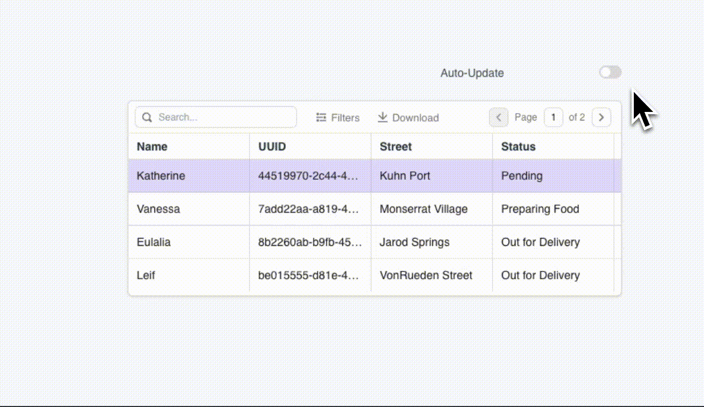

<!--
README

For guidance on how to write documenation, see https://dev.stage.spread.ai/docs/contributor/guide.html. Contact Documentation when this document is ready for review.
-->

Polling is a communication technique used to retrieve real-time data by periodically fetching the data. This page shows you how to establish a data polling mechanism for your applications.


<figure markdown="span">
     
     <figcaption>Auto updating data within an application</figcaption>
</figure>

## Prerequisite knowledge

- [x] Basic understanding of how to [build Studio applications](../creating-studio-applications.md).
- [x] Access to a SPREAD Studio environment.
- [x] An understanding of the [JSObject](/writing-code-in-studio/using-jsobjects.md)

## Instructions

### 1. Configure the query

Configure the fetch query and connect it to a [Table](/reference/widgets/table.md) widget to display the data.

For example, to display real-time delivery status updates from a query, add the following code into the **Table data** property.

```js
{{ '{{delivery_data.data}}' }}
```

2. Drop a Switch widget to enable the toggling of updates at regular intervals.

3. Create a new *JSObject* and configure the function using the [setInterval()](/reference/framework/global-functions.md/intervals-time-events) function  to implement polling:

For example, When the switch is turned on, the query is executed every 5 seconds. If the switch is turned off, use the [clearInterval()](/reference/framework/global-functions.md/clear-interval) function to stop the polling process:

```js
export default {
    startAutoRefresh() {
        if (Switch1.isSwitchedOn) {
            setInterval(() => delivery_data.run(), 5000, "autorefresh");
        } else {
             clearInterval("autorefresh");
        }
    }
}
```

3. Set the **onChange** event of the Switch widget to execute the JS function.
