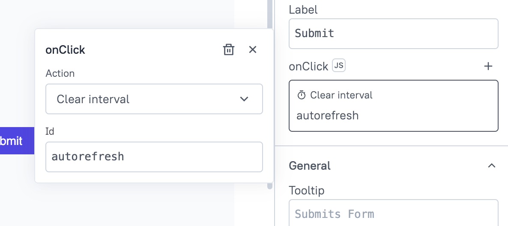
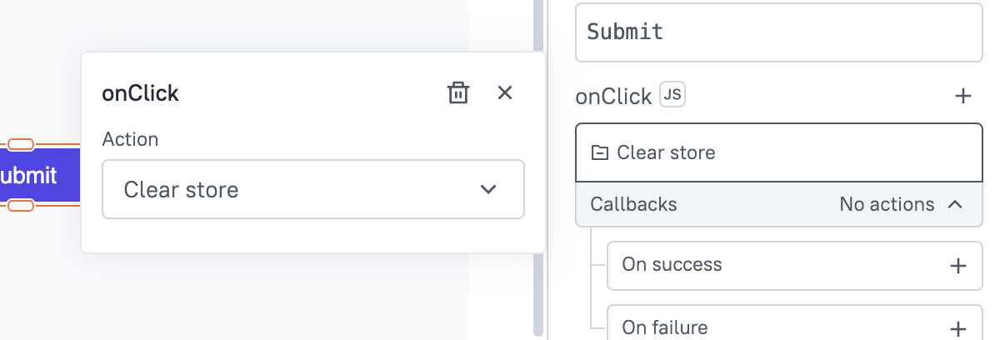
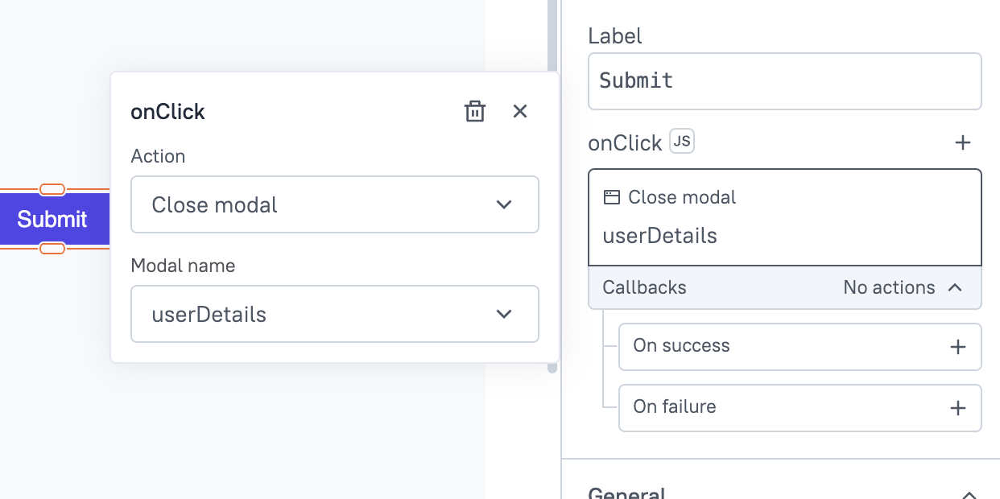
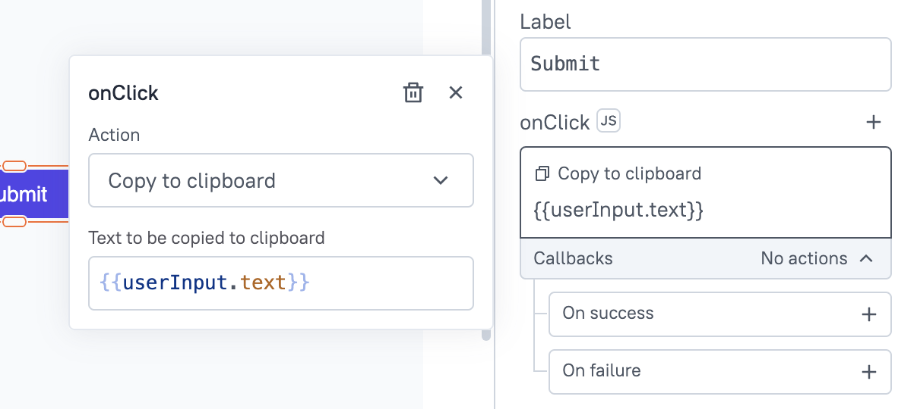
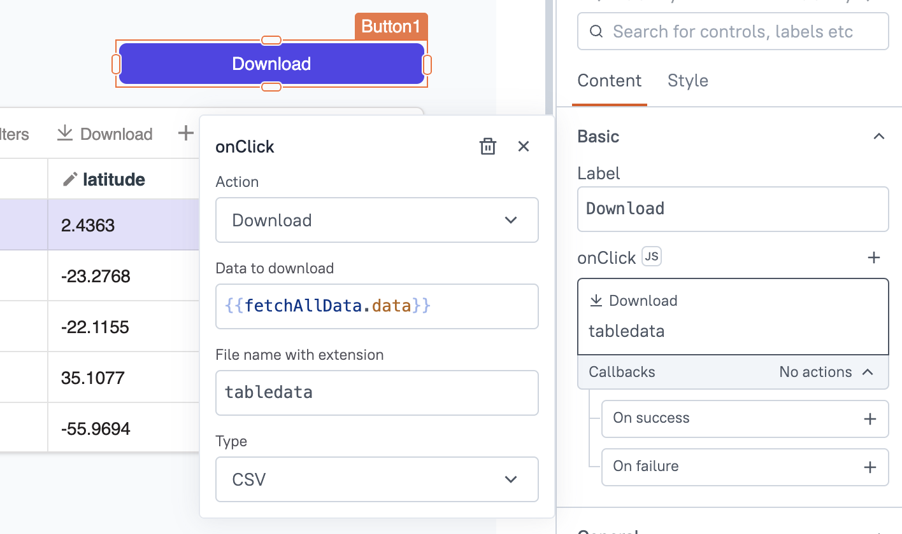
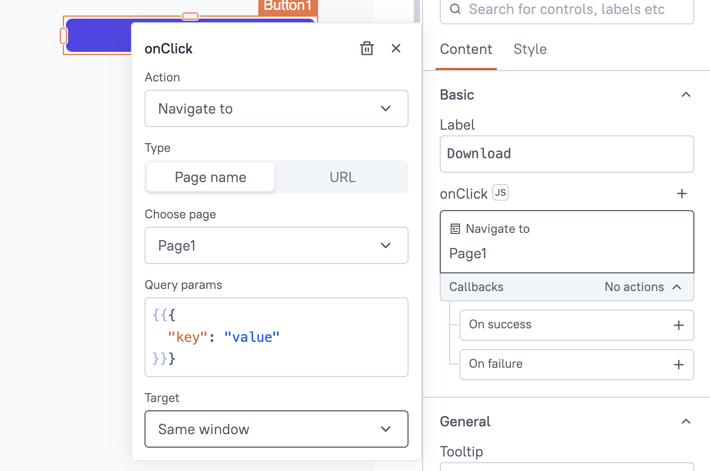
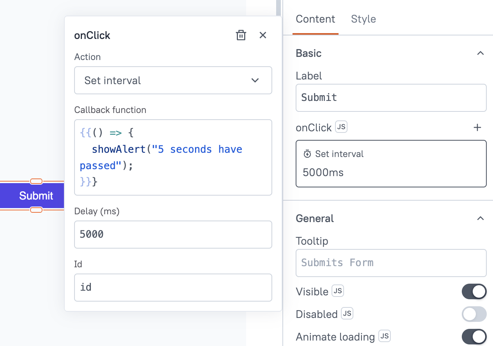
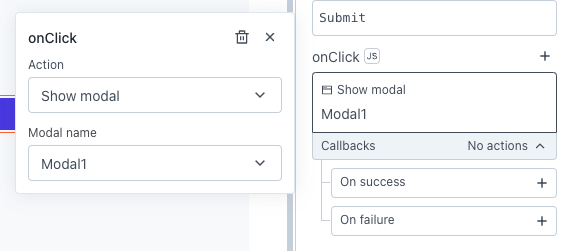

<!--
README

For guidance on how to write documenation, see https://dev.stage.spread.ai/docs/contributor/guide.html. Contact Documentation when this document is ready for review.
-->

Global functions in Studio enable you to trigger various actions for widget events and within JavaScript objects. These functions allow you to navigate to other pages, display alert messages, open or close modals, and manage data in local storage, among other capabilities.

Browse this section to learn about the different actions you can trigger in Studio.

## clearInterval()

The `clearInterval()` function allows you to stop a repeating callback that was started with the [setInterval](#setinterval) method.

<figure markdown="span">
  
  <figcaption>The clearInterval() function</figcaption>
</figure>

### Signature

```javascript
clearInterval(id: string)
```

### Parameters

#### id

The `id` is a string that represents the unique identifier of the interval timer you want to stop. This identifier must match the id specified when creating the interval with the `setInterval()` function.

### Usage

#### Stop auto-refresh

If you have a timer set up to automatically refresh data every few seconds and you want to stop it based on user interaction or a specific condition, you can use clearInterval().

```javascript
clearInterval("autorefresh");
```

## clearStore()

The `clearStore()` function clears all the data that was stored in the local storage of the browser using the [storeValue](#storevalue) function.

<figure markdown="span">
  
  <figcaption>The clearStore() function</figcaption>
</figure>

### Signature

```javascript
clearStore()
```

### Usage

If you have saved an employee's basic information using the `storeValue()` function, you can remove all the stored values by using the `clearStore()` function within a JSObject, as demonstrated below:

```js
export default {
    writeToStore: () => {
        storeValue("isActive", true). 
        storeValue("name", "Robert") 
        storeValue("pin", 9929) 
        clearStore() // (1)! 
    
    }
}
```

1. Removing all the stored values.

## closeModal()

The `closeModal()` function allows you to close an existing [Modal widget](../widgets/modal.md) that is currently open on the page.

<figure markdown="span">
  
  <figcaption>The closeModal() function</figcaption>
</figure>

### Signature

```javascript
closeModal(modalName: string): Promise
```

### Parameters

#### modalName

The name of the Modal widget you want to close.

```javascript
{{ '{{ closeModal(UserDetailsModal.name) }}' }}
```

### Usage

#### Successful query execution

If you want to close the modal after a user submits a form, you can do so using the `closeModal()` function:

```js
{{ "{{updateUsers.run().then(() => {
  closeModal(UserDetailsModal.name);
}).catch(() => {});}}" }}
```

## copyToClipboard()

The `copyToClipboard()` function allows you to copy the given string to the user's clipboard.

<figure markdown="span">
  
  <figcaption>The copyToClipboard() function</figcaption>
</figure>

### Signature

```javascript
copyToClipboard(data: string, { debug: boolean, format: string }): Promise
```

### Parameters

#### data

The string contains the text data copied to the clipboard. This parameter can be a static string or dynamically generated content. For dynamic data, you can use mustache double curly braces`{{ '{{}}' }}`.

#### debug

When set to `true`, this option logs detailed information about the clipboard operation to the console, including any potential errors or status updates. This parameter is particularly useful for debugging and troubleshooting issues with the clipboard functionality. The default value is `false`.

This setting is not part of the action selection in the UI but can be configured programmatically using JavaScript.

#### format
  
The string specifies the MIME type of the copied text, which indicates the format of the content being copied to the clipboard. This parameter can be useful when dealing with specialized content types or when you need to ensure that the copied data is recognized correctly by other applications or systems.

### Usage

Here are a few examples of how to copy content to the clipboard in different situations:

#### Copy JSON Data

If you need to copy JSON data, use the `copyToClipboard()` function with the MIME type `application/json`:

```js
function copyJsonData(data) {
    copyToClipboard(JSON.stringify(data), { debug: false, format: 'application/json' });
}
```

#### Copy Error Messages for Support

To assist with debugging, you can copy detailed error messages to the clipboard, making it easier for users to share their issues with support teams.

```js
function copyErrorMessage(errorMessage) {
    copyToClipboard(errorMessage, { debug: true, format: 'text/plain' });
}
```

## download()

The `download()` allows you to download any data as a file to your local machine. It uses the capabilities of the [downloadjs](https://github.com/rndme/download) library.

<figure markdown="span">
  
  <figcaption>The download() function</figcaption>
</figure>

### Signature

```javascript
download(data: any, fileName: string, fileType?: string): Promise
```

### Parameters

#### data

 This parameter specifies the data you want to download, which can be a URL, Query data, Blob, or any String. You can pass the data using `{{ '{{}}' }}` Mustache binding, for example `{{ '{{Userquery.data}}' }}`.

#### fileName

This property allows you to set the name of the file. You can specify a name or dynamically set it based on query or user data. For example, you can use Mustache binding to create a dynamic file name like `{{ '{{Table1.selectedRow.id}}' }}`. If there is no filename or extension specified, the download will fail.

#### fileType

This property allows you to set the MIME content-type of the file to download. If you do not specify the file type, make sure to include the appropriate file extension in the **filename** property, for example, `file_name.csv.`

The Download action does not convert the file into a specific format; it downloads the file in its original form. If you need to change the file type, you would need to convert the data to a specific format using JavaScript before downloading.

Supported file types:

* Plain text
* HTML
* CSV
* JSON
* JPEG
* PNG
* SVG

### Usage

#### Download query data

If you want to download your query or JS data into a file, such as a `.txt` or `.csv` file, you can pass the query data into the function like this:

```js
download(UserData.data, 'UsersData.csv', 'text/csv');
```

#### Download using URL

If you want to download a file from a URL, you can pass the file URL to the`download()` function. For example, if you have a Table widget with a column containing document URLs for each user, to download the document, you can use:

```js
download(UsersTable.selectedRow.documentUrl, UsersTable.selectedRow.id + '.pdf');
```

#### Format and download data

If you have data in one format and need to convert it to another format before downloading, you can use JSObject to transform the data and then download it. For example, if you want to convert JSON data into a CSV file, you can create JavaScript code like:

```js
const jsonData = userdata.data; 

let csvData = jsonData.map(row => `${row.id},${row.name},${row.email},${row.country}`).join('\n');

download(csvData, "users.csv", "text/csv"); // (1)!
```

1. Use Studio's download function to download the CSV file.

#### Download using blob

If you want to download data based on certain criteria, you can use a JSObject.

This code retrieves PDF data, creates a Blob from it, generates a temporary URL of the Blob, and triggers a download of the PDF file named `sample.pdf`.

```javascript
downloadPDF: async () => {
	let data = getPdf.data
	const blob = new Blob([data], {type: 'application/pdf'});
	const url = URL.createObjectURL(blob);
	await download(url, "sample.pdf", "application/pdf")
}
```

For files to be successfully downloaded, their contents must be served over HTTPS to prevent requests from being blocked. To prevent Cross-Origin Resource Sharing (CORS) errors, ensure that the server where the file is fetched from is CORS-enabled and returns the required headers in the response.

## navigateTo()

The `navigateTo()` function allows you to navigate and pass data between internal app pages or external URLs.

<figure markdown="span">
  
  <figcaption>The navigateTo() function</figcaption>
</figure>

### Signature

```javascript
navigateTo(pageNameOrUrl: string, params?: {}, target: "SAME_WINDOW" | "NEW_WINDOW"): Promise
```

### Parameters

#### pageNameOrUrl

The name of the page or URL you want to navigate to. For widget events, you can use the action selector to select a page name or add a URL. If you want to call the `navigateTo()` function inside the JavaScript code, use:

* For application pages: `{{ '{{navigateTo('NewPage', {}, 'SAME_WINDOW');}}' }}`
* For external URLs: `{{ '{{navigateTo('www.spread.ai', {}, 'SAME_WINDOW');}}' }}`

#### params

This property allows you to pass data across pages or external URLs. It uses the [URL](context-object.md#url) global object to pass data.

To pass data using the Action selector, use:

```js
{{ '{{ { "key": "value" } }}' }}
```

To pass data using JS, use:

```js
{{ '{{navigateTo('NextPage', { "key": "value" }, 'SAME_WINDOW');}}' }}
```

To access these values on the destination page, use:

```js
{{ '{{appsmith.URL.queryParams.key}}' }}
```

#### target

This parameter allows you to configure whether to open the page or URL in the same browser window or a new window. The default value is `SAME_WINDOW`, and you can select it from the action selector. If you are using it inside JavaScript code, you can use:

```js
{{ '{{navigateTo('NextPage', { "key": "value" }, 'SAME_WINDOW');}}' }}
```

### Usage

#### Conditional navigation

If you need to navigate conditionally, based on user roles or status, you can achieve this by implementing logic that evaluates user attributes. For example, create a new custom column in the Table widget, change the Column type to a button, and set its **onClick** event to:

```js title="Enable JS next to the event and add the code"
  currentRow.status === 'pending' 
  ? navigateTo('OrderDetailsPage', {}, 'SAME_WINDOW') 
  : navigateTo('OrderHistoryPage', {}, 'SAME_WINDOW');
}}' }}
```

#### Share data across pages

When navigating across pages within your app or to external URLs, you can share data from your current page using query parameters. For more information, see [Share variables between applications](../../tutorials/share-variables-between-applications.md).

## postWindowMessage()

Studio provides a way to enable safe cross-origin communication between different [Window](https://developer.mozilla.org/en-US/docs/Web/API/Window) objects such as application or parent window and iframes using the postWindowMessage() function.

The `postWindowMessage()` function is used to send messages between parent apps or windows and child iframes.

### Signature

```javascript
postWindowMessage(message, targetIframe, targetOrigin)
```

### Parameters

#### message

The message to send to the target iframe or window. Most JavaScript values are acceptable here, except `null` and `undefined`. This is an empty string (`""`) by default.

#### targetIframe

A string that sets where to send the message. If its value is `"window"`, the message is sent to the parent application’s window (where Studio is embedded). To send a message to an iframe embedded within Studio, the string should be the name of the Iframe widget. This parameter is `"window"` by default.

#### targetOrigin

A string that is the URL or domain where messages are allowed to be sent. A value of `"*"` allows sending to any URL. To limit sending messages to only the parent application where Studio is embedded, enter the URL of the parent application. By default, this parameter is `"*"`.

## removeValue()

The removeValue() function clears the value associated with a specified key, which was previously stored in the browser's local storage using the [storeValue](#storevalue) function.

### Signature

```js
removeValue(key: string)

```

### Parameters

#### key

A string containing the key name that acts as a unique identifier to access the associated value.

If you want to remove the value with key `isActive`, you can use the `removeValue()` function using a JS Object as shown below:  

```js
export default {
    deleteStore: () => {
        storeValue("isActive", true)
        removeValue("isActive")
            }
}
```

## resetWidget()

The `resetWidget()` function sets a widget to its default state. All user input changes are reverted and its properties' default values are applied.

#### Signature

```javascript
resetWidget(widgetName: string, resetChildren?: boolean = true) -> Promise
```

### Parameters

#### widgetName

This property specifies the name of the widget you want to reset, given as a string. For example, to reset an input widget named userInput, you can use: `{{ '{{resetWidget("userInput");}}' }}`.

#### resetChildren

An optional boolean value that determines whether all child widgets of the specified widget should also be reset. By default, this is set to true. Furthermore:

* When `true`: All child widgets of the specified widget will be reset along with the parent widget. This ensures that the entire widget hierarchy is cleared to its default state.
* When `false`: Only the specified widget will be reset, leaving any child widgets unchanged. This allows for more granular control if you only need to reset the parent widget without affecting its children.

### Usage

#### Reset all widgets in a container

If you want to reset a Container widget and all the widgets contained within it, you can use the following code.

```javascript
{{ '{{ resetWidget("Container1") }}' }}
```

#### Reset a widget without affecting its child inputs

 If you want to reset a List widget but keep the state of Input widgets contained within the list items unchanged, you can use this approach.

```javascript
{{ '{{ resetWidget("List1", false) }}' }}
```

## setInterval()

The `setInterval()` function allows you to execute a callback function with a fixed time interval between the calls.

<figure markdown="span">
  
  <figcaption>The setInterval() function</figcaption>
</figure>

### Signature

```javascript
setInterval(callbackFunction: Function, interval: number, id?: string, args?: any)
```

### Parameters

#### callbackFunction

The function or code snippet that you want to execute at regular intervals. Ensure that the function can handle being called multiple times and does not produce side effects that could lead to performance issues or memory leaks.

```js
setInterval(() => { userData.run() }, 10000, "myTimer");
```

#### interval

The time interval (in milliseconds) between each execution of the `callbackFunction`. This parameter defines how frequently the `callbackFunction` should be invoked.

#### id

The `id` is a string that can serve as a unique identifier for your `setInterval()` function. This id can be used to clear the interval using the `clearInterval()` function. By assigning a unique `id` to each interval timer, you can easily manage multiple timers and stop them as needed. For more, see [clearInterval](#clearinterval).

### Usage

#### Data polling

Data polling involves repeatedly requesting data from a server at regular intervals. This ensures that your application always displays the most up-to-date information without requiring manual refreshes from the user.

```js
startAutoRefresh() {
  setInterval(() => delivery_data.run(), 5000, "autorefresh");
}
```

For more information, see [Polling for data updates](../../tutorials/setup-polling.md).

## setTimeout()

The `setTimeout()` function allows you to execute a code once after a specified amount of time has passed. This function is commonly used to introduce delays, handle timed events, or perform actions after a certain interval.

### Signature

```javascript
setTimeout(callbackFunction: Function, delay: number)
```

### Parameters

#### callbackFunction

A function you want to call once a `delay` timer (in milliseconds) has passed.

#### delay

The time in milliseconds to wait before calling the `callbackFunction`.

You can use the [showAlert](#showalert) function to show an alert message when `delay` time has passed as shown below:

```javascript
setTimeout(() => { showAlert("5 seconds have passed") }, 5000);
```

## showAlert()

The `showAlert()` function allows you to display a temporary toast-style alert message to the user for precisely 5 seconds. The duration of the alert message can't be modified.

<ZoomImage src="/img/alert-fun.png" alt="showAlert()" caption="showAlert()" />

### Signature

```javascript
showAlert(message: string, type: string): Promise
```

### Parameters

Below are the parameters required by the `showAlert()` function to execute:

#### Message

The `message` parameter is a string that contains the text displayed in the alert message. This message is shown to the user in a temporary toast alert. You can also pass dynamic data using JS.

```js
{{ '{{showAlert('Welcome! ' + appsmith.user.username, 'info');}}' }}
```

#### Type

The `type` is an optional parameter that allows you to configure the type of the alert message, which determines the icon displayed in the toast message. It accepts the following string values:

* `info`
* `success`
* `error`
* `warning`

```javascript
{{ '{{showAlert('Data submitted successfully', 'success');}}' }}
```

### Usage

Here are a few examples to show alerts in different situations:

#### Conditional alerts

Conditional alerts are used to provide feedback to the user based on certain conditions or outcomes. For example, you can display different alert messages depending on the result of an API call. This helps users understand the success or failure of their actions.

```js
fetchDataFromAPI().then(response => {
    if (response.status === 200) {
        showAlert('Data fetched successfully', 'success');
    } else {
        showAlert('Failed to fetch data', 'error');
    }
});
```

#### Error handling

Error handling alerts are used to inform users when an error occurs during operations such as API requests or other processes. This helps users understand that something went wrong and provides troubleshooting guidance.

```js
try {
    // Some code that might throw an error
} catch (error) {
    showAlert('An error occurred: ' + error.message, 'error');
}
```

#### Asynchronous function alerts

Asynchronous function alerts provide feedback once an asynchronous operation completes. This is useful for showing alerts after operations like navigation or data fetching have finished. For example, if you need to show an alert after a query execution is completed, use async-await to ensure the query has finished running before displaying the alert.

```js
async function logout() {
    await getUsers.run(); // Wait for the query execution to complete
    showAlert('Logout Successful', 'success'); // Show the message after execution is complete
}
```

## showModal()

The `showModal()` framework function is designed to open existing [Modal widget](../widgets/modal.md) and bring them into focus on your application page. With this function, you can enhance user interactions by displaying important information, forms, or alerts within a modal overlay, ensuring a intuitive user experience.

<figure markdown="span">
  
  <figcaption>The showModal() function</figcaption>
</figure>

### Signature

```javascript
showModal(modalName: string): Promise
```

## Parameters

#### modalName <code className="parameterCodeBlock">string</code>

The name of the Modal widget you want to open or show. You can choose the Modal name from the action selector. If you don't have a Modal widget already set up, you can create a new one from the action selector. Only a single modal can be selected, and nesting of Modals is not supported.

### Usage

Here are a few examples to show Modals in different situations:

#### Show Modal using JS

If you want to use JavaScript instead of the action selector, you can enable _JS_ button next to the event and add your code:

```javascript
{{ '{{ showModal(ProductDetailsModal.name) }}' }}
```

#### Show Modal on page load

If you want to show a Modal on page load, you can achieve this by using a JSObject to call the `showModal()` function. Once you've added the function, you can enable the **Run on Page Load** toggle under the settings tab to execute your JS function when the page loads.

```javascript title="JSObject code"
export default {
    // Function to show Modal
    showMyModal() {
        showModal(UserDetailsModal.name); 
    }
} // (1)!
```

1. Enable "Run on Page Load" from JSObject settings

#### Show Modals conditionally

If you need to display Modals conditionally, based on user roles or status, you can achieve this by implementing logic that evaluates user attributes. For example, create a new custom column, change **Column type** to a button, and set its **onClick** event to:

```js title="Enable JS next to the event and add the code"
{{ '{{currentRow.role === 'admin' ? showModal(adminModal.name) : showModal(userModal.name)}}' }}
```

This code shows either the `adminModal` or `userModal` based on the role of the selected row in the `userTable`.

## storeValue()

The `storeValue()` function stores the data in the browser's local storage as key-value pairs that represent storage objects and can be later accessed anywhere in the application.

### Signature

```javascript
storeValue(key: string, value: any, persist? = true): Promise
```

### Parameters

#### key

A string containing the key name that acts as a unique identifier to access the associated value.

#### value

The data you want to save using `storeValue()`. You can save any data type in the Studio store.

#### persist

Accepts a boolean value. The default value is `true`, which ensures the persistence of the key-value pair in the browser's local storage, allowing it to be used between sessions. Setting it to `false` prevents the value from persisting, and the key gets removed when the page is refreshed or closed.

If you want to store the text of an input widget, you can use `storeValue()` as shown below:

```javascript
{{ '{{storeValue('email',input1.text)}}' }}
```

Here, `email` is the key where the value is stored, and `input1.text` is the value in the input widget that's saved in the storage object.

You can save any data type with `storeValue()`. The code snippet below shows how to store employees' basic information using a function inside a JS Object.

```javascript

export default {
	writeToStore: () => {
		storeValue("isActive", true)
		storeValue("name", "Robert")
		storeValue("pin", 9929)
	
	}
}
```

## Access stored value

You can access the values from the store by referencing the key inside the store object.

#### Signature

```javascript
{{ '{{ appsmith.store.KEY_NAME }}' }}
```

If you have stored a value with the key `email`, you can access this value anywhere in the application using the code snippet given below:

```javascript
{{ '{{appsmith.store.email}}' }}
```

## Modify value

You can update the saved value in the store, by overwriting the data using its key.

If you have stored a boolean value with the key `isActive`, you can update the boolean value from `True` to `False` using a JS Object as shown below:

```javascript
export default {
	updateStore: () => {
		if(appsmith.store.isActive === true)
			storeValue("isActive", false) 
	}
}
```

## Store multiple values

If you need to store many values, instead of making multiple calls to the `storeValue()` function, it's recommended to use an object array to store the values. All values can be assigned in a single `storeValue()` function as shown below:

```javascript
storeValue("user", { "name": "Bar Crouch", "email": "bar@spread.ai", "pin": "9984"}) 
```

The below example shows how to access the name of the employee that you have stored:

```javascript title="Access store using a JSobject"

/
    export default {
	userName: () => {
		let user = appsmith.store.user.name
		return user
	}
}

{{ '{{appsmith.store.user.name}}' }}
```

You can update the saved employee data in the storage as shown below:

```javascript title="Access store using a JSobject"
export default {
	complexUpdate: () => {
		let user = appsmith.store.user
		user.email = "barty.crouch@spread.ai"
		user.city = "Bangalore"
		storeValue("user", user)
	}
}
```

## Storage states

Studio's `storeValue()` function consists of two storage states: persistent and session state.

#### Persistent state

If you store value in the persistent state, it remains in the store across different sessions/pages and value is saved even if the page is reloaded. By default, the `persist` argument is set to **true** in `storeValue()` and so the data is saved in a persistent state.

If you don't define the value for persist argument, the value is saved in the persistent state by default.

```
{{ '{{storeValue('one',Input1.text)}}' }}
```

The persistent state is cleared out when the user logs out.

#### Session state

You can use the session state to store the value you wish to hold until the page reloads or a user closes the window. To save data in this way, add `false` to the `persist` argument in the `storeValue()` function.

```javascript
{{ '{{storeValue('two',Input2.text, false)}}' }}
```

Session state (`persist=false`) is only available till the user exits the app or refreshes a page. If the same key is available in the session and persisted states, the session value has preference.

## Asynchronous behavior of store value

`storeValue()` is asynchronous, so its execution isn't dependent on another function or task. To handle this scenario, you'll have to use async/await to control the execution.

Suppose there is a JS function that calls an API that returns a unique identifier, and you want to save the value returned using `storeValue()`.

```javascript
export default {
    getUniqueValue: () => {
        GetUniqueNameAPI.run()
        storeValue("uniqueEmail", GetUniqueNameAPI.data.uniqueName);
        showAlert("Success! Store value set: " + appsmith.store.uniqueEmail);
    }
}
```

When you run the function, you expect an alert success message with the value stored in the key `uniqueEmail` but it shows `undefined`. As `storeValue()` is asynchronous, it may execute while the API call is in progress and the value isn't saved in the storage resulting in `undefined` value.

To handle such a scenario, you can use **async/await** to ensure that the `storeValue()` function waits for the API call to complete execution.

Modify the code to use async/await as shown below:

```javascript
export default {
     getUniqueValue: async () => {
         await GetUniqueNameAPI.run()
         await storeValue("uniqueEmail", GetUniqueNameAPI.data.uniqueName);
         showAlert("Success, Store value set: " + appsmith.store.uniqueEmail);
    }
}
```

The `getUniqueValue` function calls  `GetUniqueNameAPI.run()` to fetch data from the API. The prefix `await` to the `GetUniqueNameAPI` call ensures that the control waits for API execution to complete and then moves to the following line. The prefix `await` to the `storeValue()` ensures that the value gets added to the store for the given key before executing `showAlert` in the next line.

---

## unlistenWindowMessage()

The `unlistenWindowMessage()` function allows you to disable an Studio app from reacting to messages from the parent website.

### Signature

```javascript
unlistenWindowMessage(domain: string)
```

### Parameters

#### domain

This is the address of the website with an already active action. If no active action exists in this domain, a warning appears in the console.

```javascript
unlistenWindowMessage("https://mywebsite.com")
```

## windowMessageListener()

The `windowMessageListener()` function is used to enable an Studio application to capture and react to the messages incoming from a parent application. This listener is page-scoped and is only active on the page where it's created.

### Signature

```javascript
windowMessageListener(domain: string, callback: function): Promise
```

### Parameters

#### domain

A string that is the URL or domain of the website from which Studio expects to receive a message. The listener only listens for messages from the given domain when that domain is embedded in the Studio app; If the Studio app is embedded in some other website, the callback won’t be triggered.

If an active listener is already in place, it won't be overridden and a warning appears in the console. The use of the `"*"` wildcard is not allowed in this parameter, a specific web address is required.

#### callback

A callback function to be called whenever a message is received from the target domain. It accepts a parameter that is the incoming message.

```javascript
windowMessageListener(
	"https://your-site.github.io", 
	(message) => { showAlert(message) }
)
```
