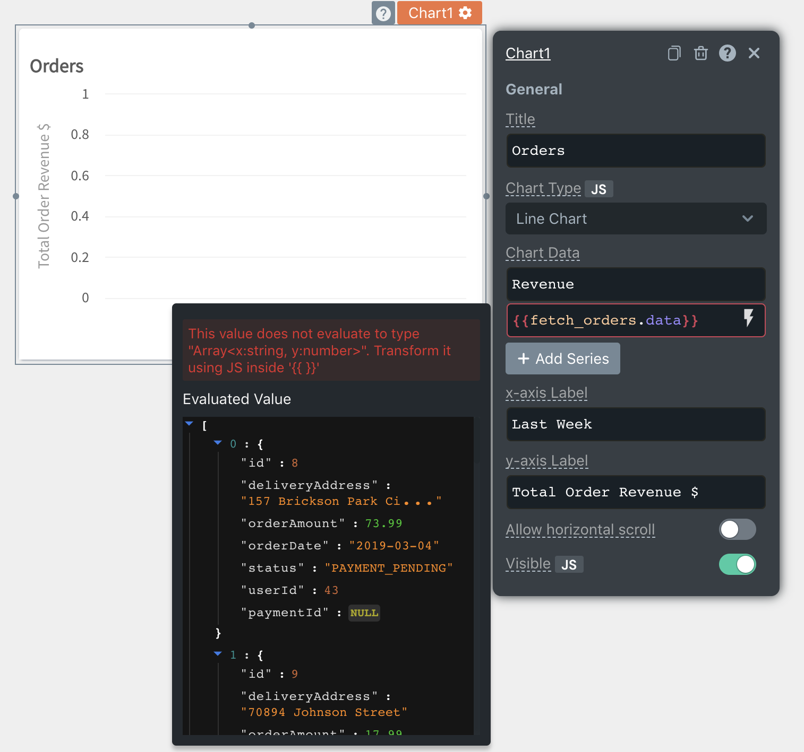

<!--
README

For guidance on how to write documenation, see https://dev.stage.spread.ai/docs/contributor/guide.html. Contact Documentation when this document is ready for review.
-->

Understanding how to effectively troubleshoot errors in Studio can save you time and help maintain a smooth development process. Studio errors fall into the following categories. For more on each type, select the relevant section:

* [Access errors](#access-control-errors)
* [Datasource errors](#datasource-errors)
* [Git errors](#git-errors)
* [Query errors](#query-errors)
* [Widget errors](#widget-errors)
* [JavaScript errors](#javascript-errors)

## Access control errors

Access control errors happen when a user cannot access a Studio application or a developer cannot edit an application. This page shows how to troubleshoot some of the most common access control errors you might encounter. Resolving some of these error may require super administrator access.

### Common access control errors

#### 404 - page not found

> The **404 - Page Not Found** error occurs when you do not have access to the requested page. In this case, access to the Home page is not provided, resulting in the error.

<div class='grid' markdown>

!!! failure "Error"

	A **404 - Page Not Found** error page.

!!! success "Solution"

     Verify if the custom role access is provided by checking the groups and role mapping or user and role assignment. If not, add users to groups that have access or assign roles to the appropriate users.

	Contact your instance administrator and request access to application, and maybe the Studio environment. For more information, see [User Management](/platform/user-management/user-management-and-permissions).

</div>

#### Make application public toggle is not available

> The **Make Application Public** toggle is controlled by the **Make Public** permission. If you do not have this permission, the toggle is disabled.

<div class='grid' markdown>

!!! failure "Error"

	The **Make Application Public** toggle in the invite users modal is disabled, preventing you from making an application public.

!!! success "Solution"

     You must contact your instance administrator and request that they provide you with the appropriate access. Alternatively, reach out to users who have the necessary permissions to make an application public.

</div>

## Datasource errors

Studio provides the ability to connect to a variety of data sources, including both databases and APIs. However, when setting up a new datasource or modifying an existing one, you may encounter connectivity errors. This guide aims to help you troubleshoot and resolve common datasource connectivity errors.

### Testing the data source

1. Navigate to your Studio application's datasource page.
2. Find the datasource in question and click on the **Test** button.
3. If the **Test Configuration** option indicates failure, proceed to troubleshoot the datasource connectivity.

### Troubleshooting datasource connectivity

* Ensure that your datasource URL, authentication credentials, and other settings are correctly configured.

* Verify that any IP whitelisting or firewall rules allow traffic from Studio's servers.
* Review any error messages returned by the Test Configuration for clues to the problem.

### Common datasource errors

#### SSL connection error

> This error message indicates that the database server that you are trying to connect to does not support SSL.

<div class='grid' markdown>

!!! failure "Error"

     ```html
	<Message messageContainerClassName="error" 
     messageContent="dev.miku.r2dbc.mysql.client.MySqlConnectionClosedException: Connection unexpectedly closed. Error was received while reading the incoming data. The connection will be closed."/>
     ```

!!! success "Solution"

     This error can be resolved by editing the SSL field in the datasource and setting it to `Disabled`.

</div>

#### Error connecting to local database or API

> If you are trying to connect to a local database from Studio and see an error message. When running Studio inside a Docker container, it may have its own network namespace and won't be able to access services running on the host machine using the `localhost` or `127.0.0.1` addresses. This is because these addresses points to the container's local network, which is different from that of the host machine.

<div class='grid' markdown>

!!! failure "Error"

     ```html
	<Message messageContainerClassName="error" 
     messageContent="Connection refused. Server logs - 'io.netty.channel.AbstractChannel$AnnotatedConnectException: finishConnect(..) failed: Connection refused: /172.17.0.1:3306'"/>
     <Message messageContainerClassName="error" 
     messageContent="dev.miku.r2dbc.mysql.client.MySqlConnectionClosedException: Connection unexpectedly closed. Error was received while reading the incoming data. The connection will be closed."/>
     ```

!!! success "Solution"

     Use the hostname `host.docker.internal` on Windows and macOS hosts, and `172.17.0.1` on Linux hosts, to access services running on the host machine from within the container.

</div>

#### Secret key required error

>When the data source returns an error about the secret key. This message indicates that `Send Studio signature header` field has been marked as `Yes` but the `Session Details Signature Key` field is left empty

<div class='grid' markdown>

!!! failure "Error"

     ```html
	<Message messageContainerClassName="error" 
     messageContent="Secret key is required when sending session details is switched on, and should be at least 32 characters in length."/>
     ```

!!! success "Solution"

     This error can be resolved by filling in the `Session Details Signature Key` field or by disabling the `Send Studio signature header` field by selecting `No`.

</div>

#### Missing URL Error

>This message indicates that the REST API's URL field in the API editor form has been left empty.

<div class='grid' markdown>

!!! failure "Error"

     ```
	DEFAULT_REST_DATASOURCE is not correctly configured. Please fix the following and then re-run: \n[Missing URL.]
     ```

!!! success "Solution"

     This error can be fixed by editing the REST API form and providing a URL.

</div>

#### Missing Client Secret / Client ID / Access Token Error

>This message indicates that the mentioned parameter fields - `Client Secret`, `Client ID`, or  `Access Token URL` have been left empty. These fields are nested in the `Authentication` sub-section which becomes visible if the `Authentication Type` field has been chosen as OAuth 2.0.

<div class='grid' markdown>

!!! failure "Error"

     ```
     DEFAULT_REST_DATASOURCE is not correctly configured. Please fix the following and then re-run: \n[Missing Client Secret, Missing Client ID, Missing Access Token URL]
     ```

!!! success "Solution"

     This error can be fixed by filling in all the parameter fields.

</div>

#### Secret key required error

>This error message indicates that `Send Studio signature header` field has been marked as `Yes` but the `Session Details Signature Key` field is left empty.

<div class='grid' markdown>

!!! failure "Error"

     ```
     Secret key is required when sending session details is switched on, and should be at least 32 characters in length.
     ```

!!! success "Solution"

     This error can be resolved by filling in the `Session Details Signature Key` field or by disabling the `Send Studio signature header` field by selecting `No`.

</div>

## Git errors

Studio allows you to manage changes in your applications using git. The errors below may occur when your git setup is misconfigured or when collaborative editing introduces complexity.

### Common git errors

### Invalid Git repo

>This error message indicates that the SSH address provided is incorrect or access rules prevent connection to the repository.

<div class='grid' markdown>

!!! failure "Error"

     ```html
     <Message messageContainerClassName='error'
     messageContent='Invalid Git repo'></Message>
     ```

!!! success "Solution"

     Verify that the SSH address is correct and functional, check connection rules on the platform where the application is deployed, and if issues persist, contact support for assistance.

</div>

#### Invalid GitConfig

>This error message indicates that there is a Redis cache issue with user profiling, which causes an invalid Git configuration.

<div class='grid' markdown>

!!! failure "Error"

     ```html
     <Message messageContainerClassName='error'
     messageContent='Invalid Git repo'></Message>
     ```

!!! success "Solution"

     Logout from the application, and then login again to refresh the user profile and Git configuration. If issues persist, contact support for assistance.

</div>

#### Conflicts while merging

>This error message indicates that conflicts arose during the merging process when the same file has been edited on both branches. Git cannot automatically resolve these conflicts.

<div class='grid' markdown>

!!! failure "Error"

     ```html
     <Message messageContainerClassName='error'
     messageContent='Conflicts while merging branch b <= a'></Message>
     ```

!!! success "Solution"

     If you are facing conflicts in the Studio UI while merging branch `A` into branch `B`, raise a pull request targeting branch `B` on your Git provider, and manually resolve the conflicts. For more information, see [Resolve merge conflicts in Git](/version-control.md#resolve-merge-conflicts-in-git).

</div>

#### Git push failed for pending upstream changes

 >If you're working on branch `A` and someone else pushes changes to the remote counterpart of the same branch, you may encounter conflicts if both have edited the same files.

<div class='grid' markdown>

!!! failure "Error"

     ```html
     <Message messageContainerClassName='error'
     messageContent='Looks like there are pending upstream changes. To prevent you from losing history, we will pull the changes and push them to your repo.'></Message>
     ```

!!! success "Solution"

     Create a new branch from your local branch `A`, naming it branch `A-fix`. Raise a pull request from branch `A-fix` against the original branch `A`. Resolve conflicts within the pull request interface or locally before merging. In Studio, discard and pull the changes into branch `A`. For more information, see [Resolve merge conflicts in Git](/version-control.md#resolve-merge-conflicts-in-git).

</div>

#### Maximum call size exceeded error

>This error is due to the size limit on the merge operation being exceeded, possibly from large files or too many changes.

<div class='grid' markdown>

!!! failure "Error"

     ```html
     <Message messageContainerClassName='error'
     messageContent='Maximum call size exceeded'></Message>
     ```

!!! success "Solution"

     Split the merge operation into smaller chunks and remove any unnecessary large files from the repository.

</div>

#### Private repo limit error

>This error occurs due to restrictions on the number of private repositories that can be connected.

<div class='grid' markdown>

!!! failure "Error"

     ```html
     <Message messageContainerClassName='error'
     messageContent='Private Repo Limit Error'></Message>
     ```

!!! success "Solution"

     In Studio, you may only connect to three private repositories.

</div>

---

## JavaScript errors

While writing JavaScript in Studio, you may encounter the following errors in your code:

* **Reference errors:** These occur when the code references an entity or variable that is not defined on the page. Review your bindings and the names of the entities to correct these errors.
* **Lint errors:** Review the syntax of the mustache bindings for any syntax errors that could be causing issues. JavaScript written inside mustache bindings can only be single line code. Use [JSObjects](../writing-code-in-studio/using-jsobjects.md) for multi-line functions.
* **Type errors:** Check your JavaScript operations to ensure you are not performing unsupported operations on certain data types.

### Debugging techniques

#### Using the debugger statement

To invoke the debugger, insert th `debugger` keyword in your code where you want to pause, and then run your app. The code execution pauses on the debugger statement. It works like a `breakpoint`. You can then use the debugger tools to step through your code, inspect variables, and see how your code is executing.

```js title="Debugger example" hl_lines="4"
export default {
     getUserDetails: async () => {
          const userInfo = await userDetailsAPI.run();
          debugger; // (1)!
          console.log("user information: " + userInfo); // (2)!
          variable is printed in the Logs tab.
          return userInfo;
     }
}
```

1. The execution is paused at this point.
2. The value of the `userInfo` variable.

### Using console.log()

In addition to using the debugger statement, you can use `console.log()` to print information about your code to the browser's console. This can help inspect the values of variables or the state of your app at different points during the execution of your code.

```js title="Console print example" hl_lines="4"
export default {
     getUserDetails: async () => {
          const userInfo = await userDetailsAPI.run();
          console.log("user information: " + userInfo); // (1)!
          variable is printed in the Logs tab.
          return userInfo;
     }
}
```

1. This will log the string "user information: " followed by the value of the `userInfo` variable to the console.

For more information on what you can print to the console, see the [Console object](framework/console-object.md) page.

### Common JavaScript errors

#### Data type evaluation errors

>This error occurs when the value in the property of the widget doesn't match the data type required by the property. When working with [Tables](../../reference/widgets/table.md) or [Lists](../../reference/widgets/list.md), you may encounter this error, as the data property expects an array of objects which might not match the data type of the API response.

<div class='grid' markdown>

!!! failure "Error"

     ```html
     <Message messageContainerClassName="error"
     messageContent="This value does not evaluate to type Array[Object]"></Message>
     ```

!!! success "Solution"

     The solution is to bind the array inside the response object or transform the response object using JavaScript. Take for an example response this response, which leads to an error when bound to a table:

     ```js
     {
          "next": "https://mock-api.docs.spread.ai/users?page=2&pageSize=10",
          "previous": null,
          "users": [
               {
                    "id": 1,
                    "name": "Barty Crouch",
                    "status": "APPROVED",
                    "avatar": "https://robohash.org/sednecessitatibuset.png?size=100x100&set=set1",
                    "email": "barty.crouch@gmail.com",
               },
               {
                    "id": 2,
                    "name": "Jenelle Kibbys",
                    "status": "APPROVED",
                    "avatar": "https://robohash.org/quiaasperiorespariatur.bmp?size=100x100&set=set1",
                    "email": "jkibby1@hp.com",
               }
          ]
     }
     ```

     To overcome this, you can bind the user's array of the response instead of the entire response object using JavaScript:

     ```javascript
     {{ '{{ fetch_users.data.users }}' }}
     ```

</div>

#### Data mismatch error

>While adding options to single-select or multi-select dropdowns, you might face a data mismatch error. In such cases, make sure the `options` property is an array of objects containing a label and value as strings.

<div class='grid' markdown>

!!! failure "Error"

     ```html
     <Message messageContainerClassName="error"
     messageContent="This value does not evaluate to type Array[{`label: string, value: string`}]"></Message>
     ```

!!! success "Solution"

     If the response doesn't contain label and value keys as below, you can map over the response to transform it using JavaScript from this:

     ```javascript title="Invalid response of fetchColors API"
     [
          'Blue',
          'Green',
          'Red'
     ]
     ```

     To this:

     ```javascript
     {{ '{{
          fetchColors.data.map((color) =>{
               return {
                    label: color,
                    value: color
               }
          })
     }}' }}
     ```

</div>

#### Value type error

>The image shows that there is an error in the `Chart Data field` of the [Chart](widgets/chart.md) widget. The Evaluated Value indicates the current value of the field, and in the image, you can see that the current value is an array while the error indicates that it must be an array.

<figure markdown="span">
     
     <figcaption>A JavaScript error in the Chart widget</figcaption>
</figure>

<div class='grid' markdown>

!!! failure "Error"

     ```html
     <Message messageContainerClassName="error"
     messageContent="The value does not evaluate to type Array [{x: string, y: number}]"></Message>
     ```

!!! success "Solution"

     You can use JavaScript to transform the data to the correct data type or access the correct data inside the object. The code reduces the `fetch_orders` data array to aggregate orders based on the date into an array `<x, y>`, where `x` is the date of the order and `y` is the order amount.

     ```javascript
     {{ '{{
          _.values(fetch_orders.data.reduce((accumulator, order) => {
               if(accumulator[order.date]) {
                    accumulator[order.date].y += order.orderAmount
               } else {
                    accumulator[order.date] = { x:order.date, y: order.orderAmount  };
               }
               return acc;
          }, {}))
     }}' }}

     ```

</div>

#### Date format error

>The date picker expects its default date in the standard [ISO format](https://www.iso.org/iso-8601-date-and-time-format.html). If the date you provided doesn't match this, you'll see this error.

<div class='grid' markdown>

!!! failure "Error"

     ```html
     <Message messageContainerClassName="error"
     messageContent="Value does not match ISO 8601 standard date string"></Message>
     ```

!!! success "Solution"

     To resolve this, you can transform the date string using [moment.js](https://momentjs.com/docs/):

     ```js title="Using moment.js to parse the date fromt"
     {{ '{{ moment("2021-07-26", "YYYY-MM-DD") }}' }}
     ```

</div>

#### Boolean type error

>This error typically occurs in the `isVisible` and `isDisabled` properties and indicates that the value in the property doesn't match a `boolean` type.

<div class='grid' markdown>

!!! failure "Error"

     ```html
     <Message messageContainerClassName="error"
     messageContent="This value does not evaluate to type `boolean"></Message>
     ```

!!! success "Solution"

     You can solve this by using a comparison operator.

     ```js
     {{ '{{ Dropdown1.selectedOptionValue === "RED" }}' }}

     ```

</div>

#### String value error

>When working with widgets, you may come across an error where the data property is expecting a string value that doesn't match the data type of the query response.

<div class='grid' markdown>

!!! failure "Error"

     ```html
     <Message messageContainerClassName="error"
     messageContent="This value does not evaluate to type string"></Message>
     ```

!!! success "Solution"

     The solution is to convert the data type of the API response to a string. This can be done using JavaScript methods. Additionally, make sure that the data being passed to the widget is in the correct format. For example:

     ```js
     {{ '{{Text1.text}}' }} // (1) !
     {{ '{{Image1.image}}' }} // (2)!
     ```

     1. To return text.
     2. To return an image.

     If this doesn't work, you can also check the **EVALUATED VALUE** section to make sure that it's returning a string value and not an object or other data type.

</div>

#### Numeric value error

>You may come across an error where the data property is expecting a numeric value that doesn't match the data type of the API response.

<div class='grid' markdown>

!!! failure "Error"

     ```html
     <Message messageContainerClassName="error"
     messageContent="This value must be number"></Message>
     ```

!!! success "Solution"

     It's important to ensure that the data being passed to the widget's data property matches the expected data type. One solution to this issue is to use JavaScript to convert the API response to the correct data type, or to access the correct data type from the API response.

     You can also check the **EVALUATED VALUE** section to make sure that it's returning a numeric value and not an object or other data type.

</div>

#### Syntax error

This error occurs when there is invalid JavaScript inside the handlebars `{{ '{{ }}' }}`. The evaluated value of the field is displayed as undefined in this case. Verify the number of braces in your code and consider re-writing your [JS as multi-line](../writing-code-in-studio/using-jsobjects.md)code.

#### Cyclic dependency error

>The cyclic dependency error happens when a node is directly or indirectly dependent on itself. All user-editable fields are defined as nodes, and to provide reactivity, a dependency map is created between these nodes to find the optimal evaluation order of these nodes. For example, when you would refer to `{{ '{{Api1.data}}' }}` in a Table1's `tableData` field, there is a dependency created between `Api1.data` and `Table1.tableData`. So every time `Api1.data` updates, `Table1.tableData` needs to be updated.

>Similarly, all parent nodes are implicitly dependent on the child nodes to ensure updates are propagated up an entity object. A more straightforward way to understand this is that if a child node updates, the parent node, and its dependencies should also be updated.

!!! success "Solution"

     The most common scenario where a cycle occurs is when you would try to bind a node to its parent node. Since it's impossible to evaluate an app with a cyclic dependency, you have to exit out and be in an error state until the cycle is resolved.

#### Infinite loop error

>An infinite loop error occurs when a function or code block repeats indefinitely, causing the app or function to become unresponsive, and can even prevent users from accessing certain features of the app.

<div class='grid' markdown>

!!! failure "Error"

     The problem may be due to a page load function that is stuck in a loop. This can happen if you have added code that uses the `navigateTo` function and is executed on `onPageLoad`, which can cause the page to become inaccessible or cause the app to get stuck in a loop and constantly routing to the destination page.

!!! success "Solution"

     To fix this problem, you can use [debugger statements](#using-the-debugger-statement) to halt the execution of the code and identify the source of the infinite loop. Here are the steps to do this:

     1. Open the app and go to the page where the infinite loop is occurring.
     2. Locate the function or code block that's causing the infinite loop.
     3. Insert a debugger statement at the beginning of the function or code block that pauses the execution of the code and allows you to inspect its state. 
     4. Use the debugger console of the browser to step through the code and identify the cause of the infinite loop.
     5. Once you have identified the issue, make the necessary changes to the code to fix it.
     6. Save the changes and test the app again to ensure the infinite loop issue has been resolved.

</div>

---

## Query Errors

Query errors occur when querying data sources. To troubleshoot these errors:

* Remove any mustache bindings temporarily and use hard-coded parameters to test the basic query.
* If the query fails to run, analyze the SQL or command errors, and adjust your query accordingly.
* In Studio, inspect the evaluated value of the query to ensure that mustache parameters are being interpreted correctly.
* Hover over parameters within your query to confirm they are present and formatted as expected.

### Common query errors

#### Timeout error

>If your API or database Query times out, it could be due to one of the following reasons: the API or database is behind a Virtual Private Cloud (VPC) which is not accessible from Studio. This can be fixed by whitelisting Studio in your database or VPC, or your query is taking too long to respond. This can be fixed by fetching smaller data sets.

<div class='grid' markdown>

!!! failure "Error"

     ```html
     <Message messageContainerClassName="error"
     messageContent="Timed out on query execution"></Message>
     ```

!!! success "Solution"

     You could resolve the error response by doing one of the following:

     - Server-side pagination: Allows you to manage and display large datasets within your application. It involves fetching and displaying only a portion of data from the server at a time, enhancing performance.
     - Timeout Configuration: The Studio server has a default internal timeout of 60 seconds. If your queries take longer than this, you can set a value greater than 60 seconds. You can set the `APPSMITH_SERVER_TIMEOUT` environment variable to a value greater than 60 seconds. For example, if you want a timeout of 80 seconds, use: `APPSMITH_SERVER_TIMEOUT=80`.

</div>

#### Base64 encoding error

>This error message indicates that the query was expecting a base64 encoded value as content body, but the actual value passed to it was not base64 encoded.

<div class='grid' markdown>

!!! failure "Error"

     ```
     File content is not base64 encoded
     ```

!!! success "Solution"

     You could resolve this error  by setting the data format property of the filepicker to base64.

</div>

#### Execution failed with status 5009

>The error response could be caused by API or query response sizes that exceed the allowed maximum limit of 5mb.

<div class='grid' markdown>

!!! failure "Error"

     ```html
     <Message messageContainerClassName="error"
     messageContent="<QUERY_OR_API_NAME> action returned an error response. Response size exceeded the maximum supported size of <SIZE_SPECIFIED_IN_FILE> MB. Please use LIMIT to reduce the amount of data fetched."></Message>
     ```

!!! success "Solution"

     You could resolve the error response by doing one of the following:

     * Limit the data returned as part of query response by using limit in the query or enabling [pagination for table](/tutorials/server-side-pagination-in-table.md).
     * Limit the data for an API by adding server-side pagination.
     * Update the maximum allowed limit by changing the environment variable for size. For example, to modify the limit for docker-based installation, navigate to the `docker.env` file and modify the `APPSMITH_PLUGIN_MAX_RESPONSE_SIZE_MB` environment variable to the desired response size.

     ```bash
     APPSMITH_PLUGIN_MAX_RESPONSE_SIZE_MB=10
     ```

</div>

---

## Widget errors

This section helps you troubleshoot common widget errors in Studio. To troubleshoot widget errors, first ensure that any data bound to the widget is in the format expected by the property. Most errors stem from this.

### Common widget errors

#### Validation error

>The error indicates that the data expected by the widget is not in the expected format.

<div class='grid' markdown>

!!! failure "Error"

     For example, a Table widget is bound to the result of an API that returns a JSON object instead of an array of objects, which the Table widget expects for its data source.

!!! success "Solution"

     Transform the JSON object into an array of objects using JavaScript within the query or within a JS Object. You can use the `.map()` function to achieve the desired transformation if the data contains an array nested within the object.

</div>

#### Sync field error

>You may see this error when executing an API, Query, JS Object in a widget property that expects data, and can't be used to trigger an action. Action refers to the execution of an API, Query, or JS object. You can only perform an action by binding it to an asynchronous field. When you bind an action to a sync field that only expects data, it throws an error.

>For example, if you are executing a storeValue() function in a `TableData` property of a table. The `TableData` property expects data and can't execute a function, and this results in an error. Similarly, if you try to execute a JS Object function `<JSOBJECT_NAME.FUNCTION_NAME>` in the `TableData` property, it throws an error.

<div class='grid' markdown>

!!! failure "Error"

     ```html
     <Message messageContainerClassName="error"
     messageContent="Found a reference to {{ '{{action}}' }} during evaluation. Sync fields cannot execute async framework actions. Please remove any direct/indirect references to {{ '{{action}}' }} and try again."></Message>
     ```

     ```html
     <Message messageContainerClassName="error"
     messageContent="Found a Promise() during evaluation. Sync fields cannot execute asynchronous code."></Message>
     ```

!!! success "Solution"

     Invoke the data property of an API, Query or JS object. For example, you have a JS Object `getLoggedInUserInfo`, which has a function `getFullNameOfLoggedInUser`. The function returns the full name of the logged-in user. You wish to add the full name and create a welcome text, `Welcome! <LOGGED_IN_USER_NAME>`. Bind the response of `getFullNameOfLoggedInUser` function to a text widget by calling the `.data` property. To bind the response, add this code:

     ```
     {{ '{{ getLoggedInUserInfo.getFullNameOfLoggedInUser.data }}' }}
     ```

</div>

#### JSON form errors

>You may see an error message when you try to bind a large query or API response to the source data property of the JSON Form widget. The problem can be caused when you are trying to bind: a large array of multiple JSON objects, a JSON object with many fields, or the whole query data rather than a selected row or triggered row in a table.

!!! failure "Error"

     ```html
     <Message messageContainerClassName="error"
     messageContent="Found a reference to {{ '{{action}}' }} during evaluation. Sync fields cannot execute async framework actions. Please remove any direct/indirect references to {{ '{{action}}' }} and try again."></Message>
     ```

     ```html
     <Message messageContainerClassName="error"
     messageContent="Source data exceeds 50 fields. Please update the source data."></Message>
     ```

!!! success "Solution"

     To determine if the problem is caused by:

     * **A large array or a huge JSON object**: Check the data and evaluate the need to display all the data on UI, as it would be painful for your users to navigate more than 50 fields.
     * **The whole query response that you bound to the source data**: Recheck the source data field you are trying to bind and select either the selected row or triggered row to bind.

     Once you have figured out the new structure for the data, make changes in the source data field.

</div>

#### Default value is missing in options

>This error occurs when the `Default Selected Value` doesn't match any of the values specified in the options property of the widget.

!!! failure "Error"

     ```html
     <Message messageContainerClassName="error"
     messageContent="Default value is missing in options. Please update the value."></Message>
     ```

!!! success "Solution"

     To fix this error, either change the value in the options property to match the selected value, or change the selected value to match an option listed in the options property. This ensures that the value selected is valid and prevents the error from appearing.

</div>
