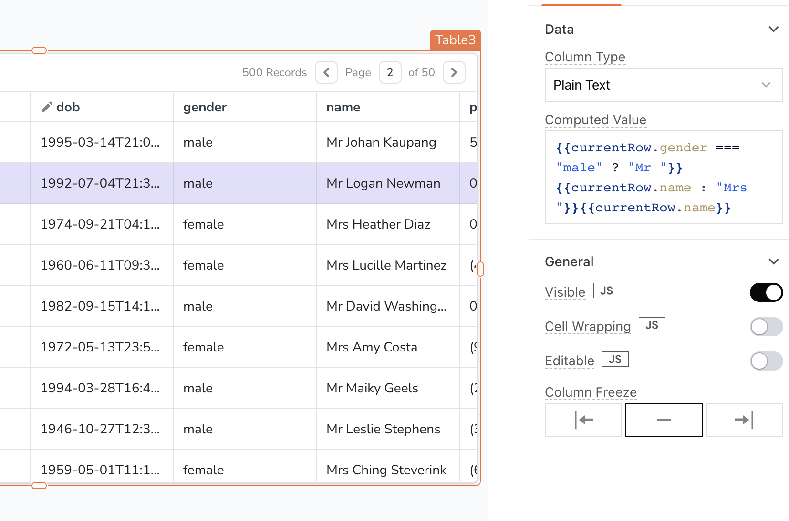
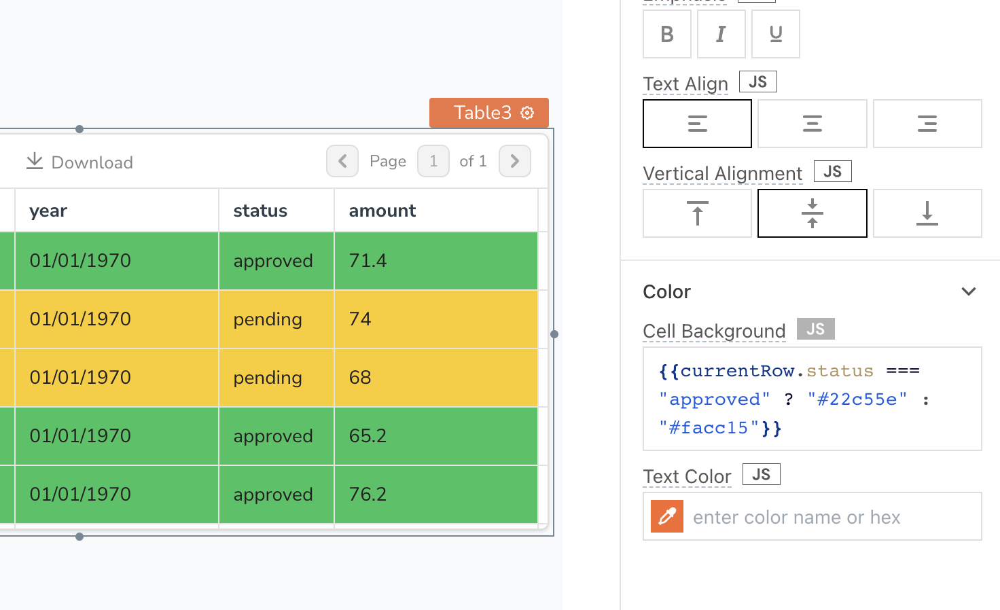

<!--
README

For guidance on how to write documenation, see https://dev.stage.spread.ai/docs/contributor/guide.html. Contact Documentation when this document is ready for review.
-->

This section provides information on using the Table widget to display data in tabular format, trigger actions based on user interaction, and work with paginated data sets of any size.

## Table settings

### Content properties

These properties are customizable options present in the property pane of the widget, allowing users to modify the widget according to their preferences.

#### Data

##### Table data `array<object>`

Allows you to connect the Table widget to your datasource. To connect your datasource to the Table widget, click on **Connect data** and select your datasource or query.

If you don't have a query, you can choose your datasource, select the desired table or collection, and specify the searchable property. Studio would automatically generate a query for you, enabling features such as server-side pagination, search capability, and the ability to edit and add new rows in the table.

Additionally, you can use JavaScript by clicking on **JS** to write bindings for the table data. The data should be specified as an array of objects, where each object in the array represents a row, and the properties of the object represent the columns in the table. In the given example format, the table has three columns: `step`, `task`, and `status`.

Expected data structure:

```js
[
     {
          "step": "#1",
          "task": "Drop a table",
          "status": "approved"
     },
     {
          "step": "#2",
          "task": "Create a query fetch_users with the Mock DB",
          "status": "pending"
     },
     {
          "step": "#3",
          "task": "Bind the query using => fetch_users.data",
          "status": "pending"
     }
]
```

You can dynamically generate a table by fetching data from queries or JavaScript functions and binding the response to the **Table Data** property. For example, if you have a query named `fetchData`, you can bind its response using:

```js
{{ '{{fetchData.data}}' }}
```

If the retrieved data is not in the desired format, you can use JavaScript to **transform** it before passing it to the Table widget:

```js
{{ '{{fetchData.data.users.map((user) => {
     return {
          name: user.name,
          email: user.email
     };
});
}}' }}
```

##### Columns `array`

The **Columns** property is automatically populated based on the **Table Data**. To access the column settings, you can click on the gear icon **⚙**️ in the properties pane. This would enable you to edit existing column properties, add new custom columns, rearrange the columns, and hide columns.

For more information, see [Column](#table-column-settings).

##### Editable `boolean`

The **Editable** property, available within the **Columns** property, is a checkbox property that allows users to modify specific fields or cells in the table. By enabling inline editing and marking columns as editable, users can update the data directly from the UI by double-clicking on the desired cell.

For more information, see [Inline editing](#table-inline-editing).

##### Update mode `string`

Determines how edited cells are saved in the table.

Options:

* **Single row**: Cells can be saved using the **Save/Discard** column buttons.
* **Multi row**: Cells can be saved by using an **onSubmit** event of the column or through an external button widget.

##### Primary key column `string`

Allows you to assign a unique column that helps maintain `selectedRows` and `triggeredRows` based on its value. This property also affects the performance of caching the dataset for quicker loading and access.

#### Pagination

##### Show pagination `boolean`

Determines whether the pagination feature is displayed in the table header, allowing users to navigate through different pages of the table.

##### Server side pagination `boolean`

Allows you to implement pagination by limiting the number of results fetched per query request.

Studio can handle query responses of up to 5 MB. To display large datasets and optimise performance, use server-side pagination. It can be implemented using Offset-based-pagination or Cursor-based pagination.

##### Total Records `number`

It is a number value that is displayed in the table header to inform the user about the total number of records in the table. This property is only visible when Server Side Pagination is enabled.

For instance, you can create a Count query to retrieve the total number of records from your datasource. You can then call this query in the **Total Records** property using the:

```js
{{ '{{Total_record_query.data[0].count}}' }}
```

##### onPageChange

Sets the [actions](../../reference/framework/global-functions.md) that would be triggered whenever the user navigates to a different page of the table, either by clicking on the pagination buttons.

##### onPageSizeChange

Sets the [actions](../../reference/framework/global-functions.md) to be executed when the height of the table is changed. This event is typically triggered by developers working on the app and not by end users. It can be useful, for example, to dynamically set a limit in your query based on the new table height.

#### Search & filters

##### Allow searching `boolean`

When enabled, the search bar is displayed, allowing users to search for specific data within the table.

##### Client side search `boolean`

Determines the search behavior of the search bar in the table header. When enabled, the search bar would only search within the data that is currently loaded in the table. If disabled, the search bar would search across the entire data set.

##### Default search text `string`

Allows you to set the default search query for the search bar in the table header.

##### onSearchTextChanged

Allows you to specify the action to be executed when the user enters a search text in the table's search bar. Learn more about [Server-side searching](/build-apps/how-to-guides/search-and-filter-table-data#using-search-text).

##### Allow filtering `boolean`

Controls the visibility of the **Filters** button, which is located in the table header. The button allows users to apply filters to the table data when enabled.

#### Row selection

##### Default selected row `number/array`

Sets which rows are selected in the table by default. When **Enable multi-row selection** is turned on, this setting expects an array of numbers corresponding to the indices of the selected rows. Otherwise, it expects a single number.

##### Enable multi-row selection `boolean`

Enables the selection of multiple rows in a table simultaneously. When enabled, the selected rows can be accessed through the `{{ '{{Table1.selectedRows}}' }}` reference property.

##### onRowSelected

Sets the [action](../../reference/framework/global-functions.md) to be executed when the user selects one or more rows in the table.

#### Sorting

##### Column sorting `boolean`

Controls whether the columns in the table can be sorted by the user. When enabled, users can click on the column headers to sort the table rows based on the values in that column. This feature is only available in *View mode*.

##### onSort

Allows you to specify the [action](../../reference/framework/global-functions.md) to be executed when the user sorts the data in the table.

#### Adding a row

##### Allow adding a row `boolean`

Adds a button to the table that allows users to add new rows of data. Users can input data in editable columns, and you can use the onSave event to update the table's data source and save the changes made by the user.

For more information, see [Inline editing](#table-inline-editing).

##### onSave

Triggered when the user clicks the save button for a new or existing row in the table.

##### onDiscard

Triggered when the user clicks the discard button for a new or existing row in the table.

##### Default values `string`

Allows you to specify the values that would be automatically populated in a new row when a user starts creating it. It expects an object with the same keys as the columns in the existing table data.

#### General

##### Visible `boolean`

Controls the visibility of the widget. If you turn off this property, the widget would not be visible in View Mode. Additionally, you can use JavaScript by clicking on **JS** next to the **Visible** property to conditionally control the widget's visibility.

For example, if you want to make the widget visible only when the user selects "Yes" from a Select widget, you can use the following JavaScript expression:

```js
{{ '{{Select1.selectedOptionValue === "Yes"}}' }}
```

##### Animate Loading `boolean`

This property controls whether the widget is displayed with a loading animation. When enabled, the widget shows a skeletal animation during the loading process. Additionally, you can control it through JavaScript by clicking on the **JS** next to the property.

##### Allow download `boolean`

Controls the visibility of the **Download** button in the table header. When enabled, users can download the table data as a `.csv` file or `Excel` file by clicking on the button.

##### Allow column freeze `boolean`

When enabled, a dropdown is displayed in the header cells of the columns, allowing users to freeze or unfreeze columns as needed.

##### CSV separator `string`

Allows you to specify the separator character to use for formatting the downloaded CSV file. This property is applicable only when the **Allow Download** property is enabled. By default, the separator character is set to `,` (comma).

### Style properties

Style properties allow you to change the look and feel of the widget.

#### General

##### Default Row Height `string`

Sets the height of the row in the table.

Options:

* Short
* Default
* Tall

#### Text formatting

##### Text Size `string`

Sets the size of the text. Additionally, the text size can be programmatically modified using JavaScript functions.

##### Emphasis `string`

Enables you to select a font style for the widget, such as bold or italic. Additionally, the font style can be programmatically modified using JavaScript functions.

##### Text Align `string`

Sets the horizontal alignment of the text within the cells.

Options:

* Left
* Center
* Right

##### Vertical alignment `string`

Sets the vertical alignment of the cell contents within the cells.

Options:

* Top
* Center
* Bottom

#### Color

##### Cell Background Color `string`

Sets the background color of the table cells. Additionally, the cell color can be programmatically modified using JavaScript functions.

For example, lets say you have a column named `status` that reflects `approved` and `pending` values. You can set the color for these values using the following expression in the **Cell Background** property:

```js
{{ '{{currentRow.status === "approved" ? "#22c55e" : "#facc15"}}' }}
```

If you want to keep the same background color for an entire row, you can use the same custom style expression in each column **Cell Background** property.

##### Text Color `string`

Sets the color for the text in the table. Additionally, the text color can be programmatically modified using JavaScript functions.

##### Background Color `string`

Sets the background color of the widget, specified as a [CSS color value](https://developer.mozilla.org/en-US/docs/Web/CSS/color). It can also be manipulated programmatically using the JavaScript functions.

##### Border color `string`

Sets a color for the border, specified as a CSS color value. It can also be manipulated programmatically using the JavaScript functions.

#### Border and shadow

##### Cell Borders `string`

Sets the border configuration for the cells of the table.

Options:

* Default
* No borders
* Horizontal borders only

##### Border radius `string`

Applies rounded corners to the outer edge of the widget. If JavaScript is enabled, you can specify valid [CSS border-radius](https://developer.mozilla.org/en-US/docs/Web/CSS/border-radius) to adjust the radius of the corners.

##### Box Shadow `string`

This property adds a drop shadow effect to the frame of the widget. If JavaScript is enabled, you can specify valid [CSS box-shadow](https://developer.mozilla.org/en-US/docs/Web/CSS/box-shadow) values to customize the appearance of the shadow.

##### Border color `string`

Sets the color of the widget's borders, specified as a [CSS color value](https://developer.mozilla.org/en-US/docs/Web/CSS/color). Additionally, the border color  can be programmatically modified using JavaScript functions.

##### Border Width `number`

Sets the thickness of the borders of the widget.

### Reference properties

Reference properties are properties that are not available in the property pane but can be accessed using the dot operator in other widgets or JavaScript functions. They provide additional information or allow interaction with the widget programmatically. For instance, to get the visibility status, you can use `Table1.isVisible`.

##### selectedRow `object`

Contains the data of the row selected by the user. It's an empty object if no row is selected.

```js
{{ '{{Table1.selectedRow}}' }} // (1)!
{{ '{{Table1.selectedRow.email}}' }} // (2)!
```

1. To access the entire selected row.
2. To access a specific cell value, such as the email field.

##### selectedRows `array<object>`

Contains an array of rows selected by the user when multi-select is enabled. It is `[null]` if no row is selected.

```js
{{ '{{Table1.selectedRows}}' }} // (1)!
{{ '{{Table1.selectedRows[0].email}}' }} // (2)!
```

1. To access the array of selected rows.
2. To access a specific cell value in the selected rows, such as the email field of the first selected row.

##### triggeredRow `object`

When a user interacts with an actionable item - such as a button - in a row, `triggeredRow` fetches the data of that column.

```js
{{ '{{Table1.triggeredRow}}' }} // (1)!
{{ '{{Table1.triggeredRow.email}}' }} // (2)!
```

1. To access the entire triggered row.
2. To access a specific cell value, such as the email field.

For example, when using Datepicker if the date is in `ISO` format and you want to display it in `DD/MM/YYYY` format, then you can achieve this by binding the Table data to the **Default date** and changing the display format through the **Date format** property.

##### isVisible `boolean`

Reflects whether the widget is visible or not.

```js
{{ '{{Table1.isVisible}}' }}
```

##### sortOrder `object`

Reflects the current column sort criteria. For example, if table rows are being sorted by the value of column `id` in ascending order, this property contains `{"column": "id", "order": "asc"}`.

```js
{{ '{{Table1.sortOrder}}' }}
```

##### tableData `array<object>`

Contains all the table data in JSON format.

```js
{{ '{{Table1.tableData}}' }}
```

##### selectedRowIndex `number`

Contains the index of the row selected by the user. Not applicable when multiple rows are selected.

```js
{{ '{{Table1.selectedRowIndex}}' }}
```

##### selectedRowIndices `array`

Contains an array of the index of the rows selected by the user. Not applicable when multi-row selection is turned off.

```js
{{ '{{Table1.selectedRowIndices}}' }}
```

##### filteredTableData `array<object>`

Contains the data of the rows left after applying any selected filters, sort rule, or search terms.

```js
{{ '{{Table1.filteredTableData}}' }}
```

##### pageNo `number`

Contains the current page number that the user is on. APIs can use it for pagination.

```js
{{ '{{Table1.pageNo}}' }}
```

##### pageOffset `number`

Contains a calculated value to represent how many records to skip when using Server-side pagination. Use this value in your query to fetch the correct set of results.

```js
{{ '{{Table1.pageOffset}}' }}
```

##### pageSize `number`

Contains the number of rows that can fit inside a page of the table. Changes along with the height & row height of the table.

```js
{{ '{{Table1.pageSize}}' }}
```

##### searchText `string`

Contains the search text entered by the user in the Table.

```js
{{ '{{Table1.searchText}}' }}
```

##### isAddRowInProgress `boolean`

Indicates whether a new row is currently being added to the table.

```js
{{ '{{Table1.isAddRowInProgress}}' }}
```

##### newRow `object`

Contains data related to the newly added row.

```js
{{ '{{Table1.newRow}}' }}
```

##### nextPageVisited `boolean`

Indicates whether the next page of data has been visited by the user.

```js
{{ '{{Table1.nextPageVisited}}' }}
```

##### previousPageVisited `boolean`

Indicates whether the previous page of data has been visited by the user.

```js
{{ '{{Table1.previousPageVisited}}' }}
```

##### tableHeaders `array<object>`

Indicates whether the table headers are visible.

```js
{{ '{{Table1.tableHeaders}}' }}
```

##### totalRecordsCount `number`

Indicates the number of pages in server-side pagination.

```js
{{ '{{Table1.totalRecordsCount}}' }}
```

##### updatedRow `object`

Contains data related to the recently updated added row.

```js
{{ '{{Table1.updatedRow}}' }}
```

##### updatedRows `array<object>`

Contains data related to updated rows.

```js
{{ '{{Table1.updatedRows}}' }}
```

##### triggeredRowIndex `number`

An index property that indicates the row index of the table that has been triggered.

```js
{{ '{{Table1.triggeredRowIndex}}' }}
```

##### updatedRowIndices `array`

Refers to an array of indices corresponding to the rows that have been updated.

```js
{{ '{{Table1.updatedRowIndices}}' }}
```

### Methods

Widget property setters enables you to modify the values of widget properties at runtime, eliminating the need to manually update properties in the editor.

These methods are asynchronous and return a [Promise](../../writing-code-in-studio/using-js-promises.md). You can use the `.then()` block to ensure execution and sequencing of subsequent lines of code in Studio.

##### setVisibility (param: boolean): Promise

Sets the visibility of the widget.

```js
Table1.setVisibility(true)
```

##### setData (param: array< object >): Promise

Sets the data to be displayed in the Table widget.

```js
Table1.setData([{ name: 'John', age: 36 }, { name: 'Jane', age: 28 }])
```

##### setSelectedRowIndex (param: number): Promise

This method allows you to programmatically select a single row in the Table.

```js
Table1.setSelectedRowIndex(2)
```

##### setSelectedRowIndices (param: [?]): Promise

This method allows you to programmatically select multiple rows in the Table. It is available when the [**Enable multi-row selection**](../../reference/widgets/table#enable-multi-row-selection-boolean) property is enabled.

```js
{{ '{{Table1.setSelectedRowIndices([1,2,5,8])}}' }}
```

## Table column settings

You can customize each table column separately by accessing properties through the gear icon **⚙**️ in the table's properties pane. This includes editing existing column properties, adding new custom columns, rearranging columns, and hiding columns.

#### Computed value

In the Table widget, computed value is a column property that allows you to display and manipulate the table data using JavaScript expressions. To make use of this feature, you can use the `currentRow` property within the column settings.

The `currentRow` property is automatically generated by default in the Table widget when you add data to the table. For instance, the computed value of a column named `dob` that displays the date of birth for each row would be `{{ "{{currentRow['dob']}}" }}`. Additionally, you can also create custom expressions that compute new values based on the data in the current row.

For example, suppose you have a table with a `name` column and a `gender` column. If you want to add a prefix of `Mr.` or `Mrs.` to the names in the `name` column based on the data in the `gender` column, you can use a computed value:

1. Fetch data from the sample **users** database using a SELECT query `fetchData` to retrieve the data:

```sql
SELECT * FROM users ORDER BY id LIMIT 10;
```

2. In the Table's **Table Data** property, display the data using:

```
{{ '{{fetchData.data}}' }}
```

3. Select the `name` column from the list of columns, and add following code in the **Computed Value** property:

```js
{{ '{{currentRow.gender === "male" ? "Mr " + currentRow.name : "Mrs " + currentRow.name}}' }}
```

The code uses a ternary operator to add a prefix of `Mr.` or `Mrs.` to the name column based on the value of the gender column in the current row.

<figure markdown="span">
     
     <figcaption>Formatting a table column</figcaption>
</figure>

### Cell Background Color

You can style each column type from the style property pane, including options to change column color. However, if you need more advanced customization, such as changing table color/column color, you can use the `currentRow` and `currentIndex` references to create custom color expressions. These expressions enable you to conditionally change color and style of individual cells based on their content, offering more flexibility than simply applying a static style to an entire column.

For example, lets say you have a column named `status` that reflects `approved` and `pending` values. You can set the color for these values using the following expression in the **Cell Background** property:

```js
{{ '{{currentRow.status === "approved" ? "#22c55e" : "#facc15"}}' }}
```

If you want to keep the same background color for an entire row, you can use the same custom style expression in each column **Cell Background** property.

<figure markdown="span">
     
     <figcaption>Setting the table cell color</figcaption>
</figure>

### Editable

When enabled, this property allows users to modify a field or cell. You can then use the Column's **onSubmit** or **onClick** event to run a query to update the data.

Additionally, you can use JavaScript by clicking on **JS** next to the **Editable** property to control it conditionally. If you are using JS, make sure to enable the **Editable checkbox** at the Table column level before adding your code.

 if you want to allow only certain users to edit the Table:

* Enable the Editable property at the Table Column level.
* Open the column settings, click **JS** for the **Editable** property, and add your code.

```javascript
{{ "{{appsmith.user.email === 'john@spread.ai' ? true : false}}" }}
```

This code checks if the email of the logged-in user is `john@spread.ai`. If it is, the property is set to true, making the column editable. If it is not, the property is set to false, keeping the column non-editable.

For more information, see [Inline editing](#table-inline-editing).

<figure markdown="span">
     
     <figcaption>An editable table column</figcaption>
</figure>

### Properties

These common properties allow you to edit the column, and customize the user actions.

| Property | Data type |Description |
| --- | --- | ---|
| **Column type**  | String  | Sets the type of cell to use in this column. There are a variety of different types that have different behaviors, such as buttons, switches, and more. |
| **Computed Value**  | String  | It allows you to manipulate the value using JS expressions. |
| **Visible**  | Boolean | Controls the column's visibility on the page. When turned off, the column won't be visible. |
| **Disabled** | Boolean | It disables input to the column type. The column type remains visible to the user, but user input is not allowed. |
| **Column Freeze** | Boolean | Controls whether to unfreeze or freeze the column to the left or right. |
| **Editable** | Boolean | A property that determines whether the user can modify a field or cell. For more information, see [Inline editing](#table-inline-editing). |
| **Required** | Boolean | Makes input to the column type mandatory. |
| **Cell Wrapping** | Boolean | Allow content of cell to be wrapped. |
| **Text**  | String  | Sets the label of the column type.  |
| **Date Format**  | String  | The Date Format property specifies the date format of the incoming data specified in the Computed Value property. For example, if the incoming date is in the format `YYYY-MM-DD HH:mm` and the option selected in the Date Format property is `DD/MM/YYYY`, then it cannot parse the date and displays 'Invalid date' in the column. 	|
| **Display Format**  | String  | The Display Format property specifies how the date information should be displayed to the user. For example, if the incoming date is in the format `YYYY-MM-DD` but the Display Format property is set to `DD/MM/YYYY`, the date information would be displayed to the user in the desired format of `DD/MM/YYYY`.      |
| **Icon**  | String  | Sets the icon to be used for the icon column type.|
| **Menu Items Source** | String  | Sets source for menu column type.   |
| **Menu Items** | List| Display list of menu items. |
| **Source Data**  | Array | This property is used to specify the data source for a dynamic menu. |
| **Configure Menu Items** | Function| You define the styles for the menu items. |
| **Add a New Menu Item**  | Function| This button adds a new item to the menu.|
| **Compact**  | Boolean | This property decides if the column type is in compact mode.|
| **Options**  | Array | Options to be shown on the select dropdown.  |
| **Placeholder**  | String  | 	Sets the placeholder text within the input box.|
| **Filterable** | Boolean | It makes the dropdown list filterable. |
| **Reset filter text on close** 	| Boolean | Reset the filter text when the dropdown is closed.|
| **Server Side Filtering** | Boolean | Enables Server Side Filtering of the data.|
| **Display Text** | String  | The text to be displayed in the column. |

### Column types

This property allows you to select the type of cell to use in the column. Currently, the following column types are available:

| Column type | Description |
| --- | ---|
| **Button** | The button column type is a cell that can be clicked by the user, which triggers an  `onClick`  event and the  `triggeredRow`  reference property retrieves the data of the corresponding row.|
| **Checkbox** | The checkbox column type denotes a binary value, with the checked and unchecked states represented by True and False, respectively. This column type can be made [editable]( /reference/widgets/table/inline-editing) by enabling the Editable property in the column settings.  |
| **Icon Button** | The Icon button column type is a clickable button with an icon instead of text. It triggers an `onClick` event and the `triggeredRow` reference property retrieves the data of the corresponding row.|
| **Image** | The image column type displays an image by interpreting the cell value as an image source `URL` or `base64` data. It shows `Invalid Image` if the data is not valid.|
| **Menu Button** | The menu button column type is a group of buttons that can be expanded into a menu. Menu items can be added dynamically using the Menu Items Source as Dynamic and the `{{ '{{currentRow}}' }}` referencing inside the Source Data property. However, for configuring the menu items, only the `{{ '{{currentItem}}' }}` and `{{ '{{currentIndex}}' }}` can be used. |
| **Number** | The number column type is used for numeric data and supports [inline editing](../../reference/widgets/table/inline-editing). It can be made editable by enabling the Editable property in the column settings.  |
| **Plain Text**  | The plain text column type represents data with readable characters and supports [inline editing](../../reference/widgets/table/inline-editing). It can be made editable by enabling the Editable property in the column settings.  |
| **Table Column** | The Table Column column type allows users to toggle a single item on or off, using binary values. It supports [inline editing](../../reference/widgets/table/inline-editing) and can be made editable by enabling the Editable property in the column settings. |
| **URL**  | The URL column type interprets the cell value as a hyperlink, allowing users to click on the cell and open the corresponding URL in a new browser tab. It requires including the domain and suffix of the URL, such as `example.com`.  |
| **Video** | With the video column type, you can display videos within a table. To add a video to a cell, simply provide a source file path or URL from platforms such as YouTube, Facebook, Twitch, SoundCloud, Streamable, Vimeo, Wistia, Mixcloud, or DailyMotion as the cell value. |
| **Date** | The Date column type allows you to set up custom formatting options for date and time information. You can format and display the date using the Date Format and Display Format properties. It supports [inline editing](../../reference/widgets/table/inline-editing).    |
| **Select** | The Select column type allows users to select an option from a predefined list of choices. The Options property should be an array of objects, with each object containing a  `label`  and a  `value`  property,  `[{ "label": "ABC", "value": "abc"}]` .   The select column type can only be displayed or edited when the [Editable](../../reference/widgets/table/inline-editing) property is enabled in the column settings. |

### Style properties

Style properties allow you to change the look and feel of the column type.

| Property | Data Type | Description |
| --- | --- | ---- |
| **Text Size**  | String | Sets the size of the text in the column.|
| **Emphasis** | String | Toggles bold or italic emphasis on the text. |
| **Text Align** | String | Sets the horizontal alignment of the text.|
| **Border Radius** | String | Allows you to define curved corners. |
| **Box Shadow** | String | Applies a shadow effect to the cells in the column. |
| **Button Variant** | String | Sets the visual style for buttons in the column.|
| **Button Color**  | String | Sets the background color for buttons in the column.|
| **Cell Background** | String | Sets the background color for the cells in the column. |
| **Horizontal Alignment** | String | Sets the horizontal alignment of content within cells. |
| **Vertical Alignment** | String | Sets the vertical alignment of content within cells.|
| **Text Color** | String | Sets the color for the text in the column.|
| **Image Size** | Options| Allows you to resize an image for Image column type.|
| **Position** | Options| Sets the position of the cell. |
| **Icon**  | String | Displays an icon within the cell. |

## Table inline editing

This section shows you how to add and edit rows on Table through inline editing.

### Prerequisites

A Table widget connected to a query that holds the data you want to edit and update.

### Update single row

To update a single row, follow these steps:

1. Enable inline editing by checking the **Editable** checkbox for the desired columns in the Table widget properties panel. To make columns editable programmatically using JavaScript logic, see the [editable columns](#editable) section.
2. Select **Single row**  from the **Update mode** property. This enables the **Save/Discard** column with Save and Discard buttons.
3. Create a query using the `updatedRow` reference property to retrieve the updated data from the Table. If you want to modify the `name`  and `phone` field in a `users` database.

```sql
UPDATE users SET 
  name = {{ '{{Table1.updatedRow.name}}' }},
  phone = {{ '{{Table1.updatedRow.phone}}' }}
  WHERE id = {{ '{{ Table1.updatedRow.id }}' }};
```

4. Click on the gear icon **⚙**️ next to the **Save/Discard** column in the property pane.
5. Set the **onSave** event to run the update query, and the **onSuccess** callback to trigger the fetch query that refreshes the table data with the updated information.

Alternatively, you can configure the **onSubmit** event for each [Column](#table-column-settings) to run a query that saves the new data. The **onSubmit** event is triggered when the user clicks away from the edited cell or presses the Enter key within it.

### Update multiple rows

To update multiple rows at once using the inline editing feature, follow these steps:

1. Enable inline editing by checking the **Editable** checkbox for the desired columns in the Table widget properties panel. To make columns editable programmatically using JavaScript logic, see the [editable columns](#editable) section.
2. Select **Multiple rows** from the **Update mode** property, and set the **Primary Key** column for row identification during updates.
3. Create a query using the `updatedRows` reference property to retrieve the updated data from the Table. If you want to modify the `name`  and `phone` columns in a `users` database.

```sql
UPDATE users
SET name = CASE
     {{ "{{Table2.updatedRows.map((user) => `WHEN id = ${user.id} THEN '${user.updatedFields.name}'`).join('\n')}}" }}
END,
phone = CASE
     {{ "{{Table2.updatedRows.map((user) => `WHEN id = ${user.allFields.id} THEN '${user.updatedFields.phone}'`).join('\n')}}" }}
END
WHERE id IN ({{ "{{Table2.updatedRows.map((user) => user.allFields.id).join(',')}}" }});
```

4. Turn off prepared statements in the query editor for this configuration to facilitate dynamic SQL construction and maintain compatibility with the provided example.

5. Drop a Button widget, and set its **onClick** event to run the update query, and the **onSuccess** callback to trigger the fetch query that refreshes the table data with the updated information.

### Delete row

To delete the data from a Table row, follow these steps:

1. Add a new column to the Table widget and set its **Column Type** to **Button**.
2. Add a query to delete the selected Table row based on the [triggeredRow](#triggeredrow-object) property:

```sql
DELETE FROM product 
WHERE id = {{ '{{tbl_products.triggeredRow.id}}' }}; 
```

3. Add Execute query action to the **onClick** event of the Button you added in Step 1 to run delete query.
