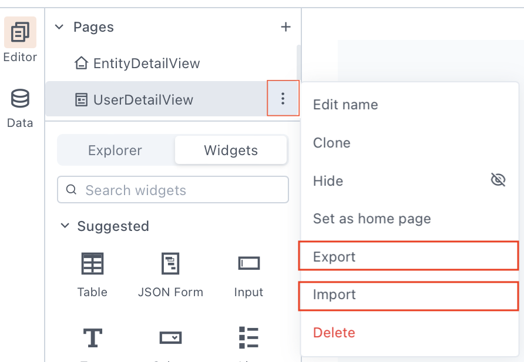

<!--
README

For guidance on how to write documenation, see https://dev.stage.spread.ai/docs/contributor/guide.html. Contact Documentation when this document is ready for review.
-->

This guide shows how to export certain entities from a page and import them into another page or application. Reusable entities are widgets, datasources, queries, JS Objects, and custom libraries.

## Prerequisite knowledge

- [x] Basic understanding of how to [build Studio applications](../creating-studio-applications.md).
- [x] Access to a SPREAD Studio environment.

## Instructions

### 1. Open the action menu

Open the page from which you want to export the entities. Click the vertical dots icon next to the page name for the action menu.

### 2. Open the export menu

Select the **Export** option from the action menu. A dialog box will appear, allowing you to choose the entities you want to reuse.

<figure markdown="span">
     
     <figcaption>Select entities to export or import</figcaption>
</figure>

### 3. Select entities

Select the specific entities under each category and click **Export selected entities** to download the JSON file. The JSON file follows the naming convention: `applicationname.json`. The JSON file can't be used to create a new application.

### 4.Open the destination page

Open the page where you want to import the entities. Click the vertical dots icon next to the page name for the action menu.

### 5. Select the **Import** option from the action menu

### 6. Import the entities

A dialog box appears. You may choose to drag and drop or go to the location of your exported JSON file on your system and upload it. Upon completion of the import process, the entities from the JSON file will be available on the current page.

As an added security measure, Studio does not export or import any configuration values used for connecting to a datasource. After importing, you will have to manually configure the datasource for the newly imported entities.
